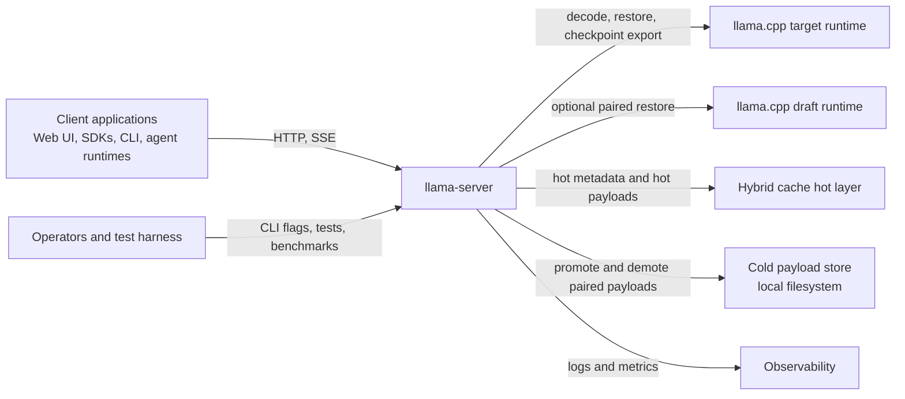
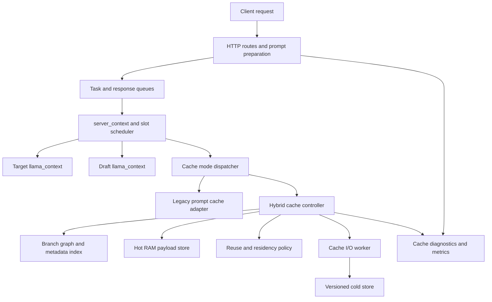
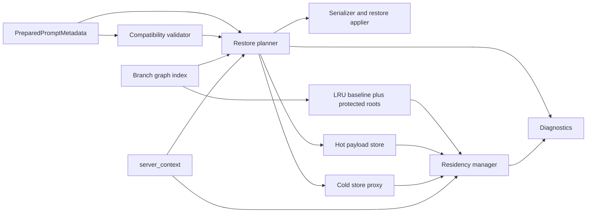
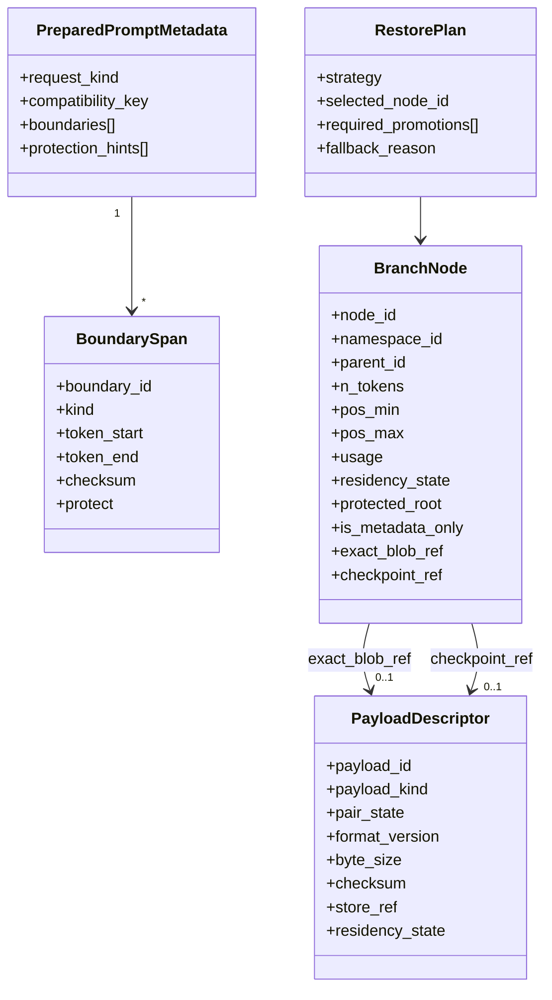
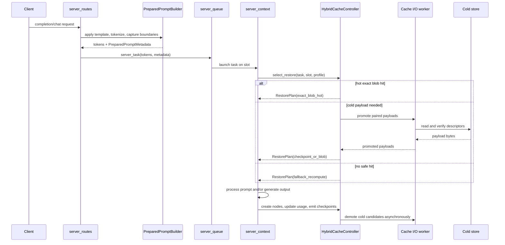
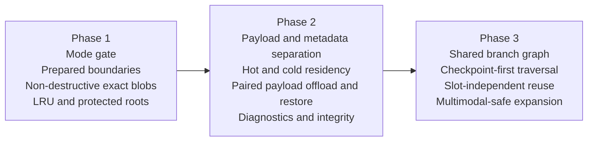

# Software Architecture: Alternate Hybrid Cache Mode for llama-server

Status: Proposed  
Date: 2026-05-24  
Primary source: `cache-handling-requirements.md`

## Method

This document follows a C5-style extension of the C4 model:

1. Identify the architecture drivers from the requirements.
2. Compare them with the current `llama-server` cache, checkpoint, and slot lifecycle.
3. Describe the target architecture in five views: Context, Container, Component, Code, and Decision/Delivery.
4. Capture each significant decision as an ADR with researched alternatives, rationale, and consequences.
5. Map the design to phased delivery, security review, observability, and verification.

## Executive Summary

The current `llama-server` cache design is optimized for a simpler RAM-only prompt cache: prompt-cache entries are destructive on hit, eviction is FIFO, checkpoints are lineage-local to a slot prompt, and shorter reusable roots may be removed when a longer descendant is saved. That behavior is adequate for the existing default mode, but it does not satisfy the requirements for branch-heavy, checkpoint-dependent workloads.

The proposed architecture introduces an alternate, explicitly selected `hybrid` cache mode that keeps the current default mode intact. In hybrid mode:

- full-state blobs remain available for exact restore
- checkpoints become the canonical branch structure for checkpoint-dependent workloads
- branch metadata remains resident in RAM even when payload bytes move between hot and cold tiers
- target and draft state are managed as an atomic pair
- cache hits are non-destructive and branch nodes are shared across slots
- a reuse-aware policy replaces FIFO and integrates protected roots, hot/cold residency, and explicit diagnostics

The design is intentionally conservative about integration risk. The current legacy cache path remains structurally intact. New behavior is introduced through a mode gate, a cache-controller interface, and dedicated components for branch graph management, residency policy, payload stores, and prepared-prompt boundary metadata.

## Significant Architecture Requirements

| Driver | Requirement IDs | Architectural response |
| --- | --- | --- |
| Opt-in compatibility | R1-R4, R4a, R107-R111 | Introduce an explicit cache mode switch and a cache-controller dispatch boundary. Leave the legacy path behaviorally unchanged when the alternate mode is disabled. Exact blob restore must remain a supported path in the alternate mode. |
| Hybrid restore model | R5-R14, R37-R60, R69-R89 | Keep exact full-state blobs, promote checkpoints to first-class reusable branch nodes, and support both plain-transformer and checkpoint-dependent restore strategies. |
| Non-destructive shared reuse | R15-R26, R74-R83 | Replace destructive cache hits and flat prompt ownership with a shared branch graph/forest, byte-accounted reuse policy, and protected roots. |
| Prepared-prompt boundaries | R27-R33, R115 | Generate boundary metadata in the HTTP/prompt-preparation layer and carry it into `server_task` so `server_context` never needs to reconstruct message boundaries heuristically. |
| Payload separation and residency | R37-R60, R93-R98 | Separate metadata from payload bytes, keep metadata in RAM, and move both full-state blobs and checkpoint payloads between hot RAM and a versioned cold layer. |
| Target/draft correctness | R9-R10, R13, R52, R104 | Treat target and draft payloads as one paired restore/offload/evict unit unless no draft side exists. |
| Fail-safe correctness | R34-R36, R90-R92, R120-R124 | Make restore plans explicit, validate compatibility and integrity before applying state, and fall back to valid slower paths on failure. |
| Security, observability, and testability | R61-R68, R66a, R121-R129, R132-R133 | Add explicit diagnostics, versioned descriptors, checksums, deterministic clocks/storage seams, and a focused OWASP review for file handling and integrity. Distinguish branch-pruning events from payload-eviction events in metrics and logs. |
| Metadata-only branch nodes and payload/pruning lifecycle | R38a, R38b, R38c, R71a, R71b, R71c, R71d, R71e, R76a, R79a, R79b | Distinguish payload eviction from branch pruning as separate lifecycle events. Retain nodes as metadata-only when their payload is evicted but their topology is needed for descendant discovery or traversal. Re-materialize nodes from the nearest retained payload-bearing ancestor when selected. |
| Validation mismatch and mismatch-parent selection | R36a, R36b, R36c, R36d, R39a, R39b, R39c, R71e, R123a | Reject re-materialization on token mismatch; emit explicit diagnostics; create a new branch from the latest validated ancestor using deterministic tie-breaking on candidate paths. |
| Three-part configurable budget and pruning preference | R8a, R8b, R21a, R57a, R57b, R57c | Define separate configurable budgets for hot payload RAM, branch-metadata RAM, and cold-layer storage. Prefer payload demotion or offload before branch pruning when limits can be satisfied by demotion alone. |
| Equivalent-branch deduplication | R83a | When multiple requests converge on the same validated prompt path, reuse or join the equivalent branch node rather than create duplicate nodes. Use deterministic tie-breaking for convergence selection. |
| Eviction policy selection and configuration | R20a, R20b | Provide an explicit CLI option for selecting the reuse-aware eviction policy so additional policies can be introduced without changing the operator interface. Policy-specific parameters must be configurable through explicit server settings. |
| Code quality and best practices | R130, R131 | Follow SOLID, KISS, DRY, and YAGNI principles. Factor repeated policy, serialization, residency, and restore logic into shared helpers or components. Avoid copy-pasted logic unless duplication is clearly justified by correctness, isolation, or performance. |

## Current Architecture Baseline

The current server has five behaviors that matter directly to this design.

| Current mechanism | Current behavior | Gap against requirements |
| --- | --- | --- |
| Prompt cache | `server_prompt_cache` stores tokens plus full serialized target and optional draft state in RAM; hits restore and erase the chosen entry; eviction is FIFO; prefix rules delete shorter contained roots. | Violates non-destructive reuse, protected-root retention, shared branch ownership, and checkpoint-first branch continuity. |
| Context checkpoints | `common_prompt_checkpoint` objects are attached to `server_prompt`, pruned oldest-first, and invalidated when rollback/shift makes them unsafe. | Checkpoints are lineage-local, not first-class reusable nodes with independent residency. |
| Idle-slot caching | Idle slots may be saved into prompt cache and cleared when `--cache-idle-slots` is enabled. | Helps RAM pressure, but still feeds the same destructive FIFO cache and does not preserve branch topology. |
| Slot save/restore | The `/slots/{id}` save and restore actions provide exact save/load behavior using the current slot state path. | Exact restore must remain available, but this path is not a substitute for shared branch metadata or paired hybrid residency. |
| HTTP prompt preparation | Chat template application and tokenization already occur in the HTTP layer before work reaches `server_context`. | This is the correct seam for prepared-prompt boundary metadata, but the metadata does not exist yet. |

### Baseline Gaps

- Exact blob restores exist, but they are one-shot cache objects instead of persistent reusable nodes.
- The current prompt cache conflates metadata, payload bytes, eviction policy, and reuse selection.
- Shorter roots can be deleted as "obsolete," which is the opposite of the required shared-tree behavior.
- Checkpoints are not independently addressable, rankable, or cold-resident.
- There is no cold layer, no versioned payload descriptor, and no integrity contract for offloaded payloads.
- There is no explicit request-to-task boundary metadata path for message-aware checkpoint placement.

## Target Architecture

### Design Principles

- Preserve the default mode. The current path remains the `legacy` cache mode and must be easy to reason about.
- Add new behavior through extension boundaries, not scattered conditionals.
- Keep branch metadata always hot in RAM and move only payload bytes between hot and cold tiers.
- Treat target and draft state as one atomic cache object.
- Prefer exact blob restore for plain-transformer workloads and checkpoint-first traversal for checkpoint-dependent workloads.
- Keep all correctness checks explicit and fail closed when compatibility or integrity is uncertain.

### Logical Model

The hybrid mode introduces four core concepts:

1. `PreparedPromptMetadata`
   Captures boundaries, stable spans, protection hints, and request-local cache markers after prompt preparation and tokenization.

2. `BranchNode`
   A reusable node in a shared branch forest. A node may reference a full-state blob, a checkpoint payload, or both. A node may also exist as a **metadata-only node** — without any owned payload descriptor — when it must be retained to preserve topology, lookup, or traversal semantics for retained descendants whose payloads are still restorable. A metadata-only node that becomes the selected restore or branching point must trigger re-materialization from the nearest retained payload-bearing ancestor or from the root.

3. `PayloadDescriptor`
   Metadata for the actual bytes of a full-state blob or checkpoint payload. Descriptors are always hot; payload bytes may be hot or cold.

4. `RestorePlan`
   An explicit plan produced by the hybrid cache controller for exact-blob restore, checkpoint-first restore, or safe fallback.

### Workload Profiles

The restore planner operates with an explicit workload profile instead of one universal algorithm.

- `plain_transformer`: exact blobs and normal prefix reuse remain efficient and valid.
- `checkpoint_dependent`: checkpoints become the canonical branch structure because reuse safety depends on SWA, RS limits, recurrent behavior, or equivalent context restrictions.
- `target_plus_draft`: restore, offload, demotion, and eviction operate on a paired target/draft object.

The workload profile is derived from model/runtime capabilities and request configuration, then attached to the task namespace used by the cache controller.

### Recommended Integration Boundaries

| Proposed module | Responsibility |
| --- | --- |
| `server-cache-mode.*` | Cache-controller interface and `legacy` vs `hybrid` mode dispatch. |
| `server-cache-hybrid.*` | Main hybrid cache controller used by `server_context`. |
| `server-cache-graph.*` | Shared branch graph/forest metadata, indexes, and branch traversal. |
| `server-cache-policy.*` | LRU baseline policy, protected-root handling, and extension point for SLRU/2Q. |
| `server-cache-store.*` | Payload descriptors, serializer contracts, hot store, and cold store abstractions. |
| `server-cache-io.*` | Asynchronous cold-store promotion/demotion worker with deterministic test hooks. |
| `server-cache-boundaries.*` | Prepared-prompt boundary metadata types and normalization helpers. |
| `server-task.*` updates | Task-level cache metadata transport from HTTP layer to `server_context`. |
| `server_context.*` updates | Slot lifecycle hooks that call into the cache controller instead of manipulating hybrid state directly. |

The exact filenames can change, but the responsibility split should remain.

## C5 View

### C1: System Context

The alternate mode changes the internal cache architecture without changing the server's role in the broader system.

### C2: Container View

The important container-level change is the separation between HTTP prompt preparation, cache orchestration in `server_context`, and a dedicated cold-store I/O path.

### C3: Component View

In hybrid mode the cache controller is the only component allowed to decide branch matching, restore selection, offload, or eviction.

Component responsibilities:

- `Compatibility validator`: checks model namespace, tokenizer/template assumptions, LoRA or draft pairing, multimodal safety, and descriptor versions.
- `Restore planner`: ranks exact-blob, checkpoint-first, and fallback candidates.
- `Branch graph index`: stores parent-child relationships, span keys, usage, protection, and residency metadata.
- `Residency manager`: enforces budgets and decides demotion or promotion candidates.
- `Serializer and restore applier`: the only component that turns descriptors back into target/draft runtime state.

### C4: Code View

#### Data Schema

#### Restore and Residency Flow

### C5: Decision and Delivery View

The design is intentionally staged.

## Runtime Semantics

### Namespace and Compatibility

Every branch graph belongs to a compatibility namespace. The namespace must prevent unsafe cross-restore between materially different runtimes.

At minimum the namespace key should include:

- target model identity
- draft model identity or absence of draft
- tokenizer-compatible prompt semantics
- cache workload profile
- material runtime modifiers that affect state validity, such as active adapters or incompatible multimodal settings

If the namespace does not match, the hybrid cache controller must reject the candidate and fall back safely.

### Branch Graph Semantics

- The graph is a forest, not a flat list.
- Shared roots are preserved even when longer descendants exist.
- Slots hold transient references to graph nodes; they do not own branch objects.
- A node may point to an exact full-state blob, a checkpoint payload, or both.
- Branch metadata remains in RAM even when payload bytes are cold.
- Node-level usage, residency, and protection state drive policy decisions.
- **Payload eviction and branch pruning are distinct lifecycle events.** Payload eviction removes payload bytes and clears the payload descriptor from a node; branch pruning removes the node and its metadata from the graph entirely. A node whose payload has been evicted may remain in the graph as a metadata-only node as long as its topology is needed for retained descendants.
- Branch pruning decisions must consider descendant reachability, protection state, and remaining reuse value. Payload eviction alone does not automatically trigger branch pruning.
- When an intermediate node is retained only as a metadata-only node, parent-child topology must remain valid for all retained descendants.
- When multiple requests or slots converge on the same validated prompt path, the implementation must reuse or join the equivalent branch node rather than create duplicate nodes. Convergence selection must use deterministic tie-breaking.
- Each payload descriptor belongs to exactly one branch node. If a retained descendant must remain independently restorable after an ancestor is pruned, that descendant must own its own separate payload descriptor.

### Metadata-Only Branch Nodes and Re-materialization

When a branch node's payload is evicted, the node transitions to metadata-only state. Its token span, checksum span, usage, protection, and parent-child links remain in RAM; only the payload descriptor and bytes are removed.

Rules for metadata-only nodes:

- A metadata-only node may remain in the graph indefinitely as long as its topology is needed for descendant discovery, lookup, or traversal.
- When branch pruning removes a metadata-only ancestor, cold-layer cleanup must verify that no retained descendant relies on a descriptor owned by the pruned node before deletion proceeds.
- When a metadata-only node is selected as the restore or branching point:
  1. Identify the nearest retained payload-bearing ancestor or the root.
  2. Validate the path segment from that ancestor to the selected node against branch metadata using span length, token-range checks, checksums, or equivalent.
  3. On successful validation, replay the path segment from the ancestor's payload, and materialize a new payload at the selected node. Do not materialize payloads for intermediate metadata-only ancestors unless independently justified by policy.
  4. On validation mismatch, do not overwrite or silently repurpose the existing branch metadata. Apply mismatch-parent selection (see Restore Strategy Order, step 2b) and create a new branch from the latest validated ancestor.
- Payload ownership is singular: each payload descriptor belongs to exactly one node. If a descendant must remain independently restorable after its ancestor is pruned, it must hold its own separately owned descriptor.

### Restore Strategy Order

The restore planner should evaluate candidates in this order:

1. Validate namespace and pairing compatibility.
2. Check for an exact full-state blob hit at the deepest matching node.
   - 2a. If the selected node is metadata-only, perform stepwise token validation of the selected path segment against branch metadata (span length, token-range checks, checksums, or equivalent) before proceeding.
   - 2b. On validation mismatch, reject re-materialization of the mismatched path; emit explicit diagnostics; select the deepest validated ancestor on the candidate path as the parent for new-branch creation. If no ancestor validates, use the root. If multiple candidate paths remain eligible after stepwise validation, prefer the path with the longest validated prefix; resolve any remaining tie with a deterministic rule. Any newly materialized payload must belong to the new branch, not to the mismatched metadata-only node.
3. For checkpoint-dependent profiles, traverse checkpoint nodes first and use exact blobs only as accelerators or roots.
4. For plain-transformer profiles, prefer exact blobs and fall back to safe checkpoint reuse only when valid.
5. For metadata-only nodes selected as the restore or branching point, re-materialize from the nearest retained payload-bearing ancestor or from the root. Validate the path segment before replay; materialize a new payload only for the selected node unless additional payloads are independently justified by policy.
6. Promote any cold paired payloads before modifying live slot state.
7. Apply restore atomically to target and draft state.
8. If any stage fails, emit diagnostics and fall back to valid slower processing.

### Prepared-Prompt Boundary Model

The alternate mode depends on prompt boundaries created after prompt preparation, not reconstructed later from the flattened prompt string.

Recommended behavior:

- Chat endpoints: extend the prompt-preparation path so template application can return both the flattened prompt and a boundary trace for message/tool/media boundaries.
- `/completion`: support an equivalent wrapper or explicit marker payload for callers that want message-aware caching; otherwise fall back to token-position rules.
- Boundary metadata must be normalized into `PreparedPromptMetadata` and attached to `server_task` before the task enters `server_context`.
- If no prepared metadata exists, the hybrid planner may use token/position fallback rules, but it must log that it is operating without prepared boundaries.

### Residency and Eviction Rules

Hybrid mode uses resident-byte accounting across both payload classes.

- **Three independent configurable budgets apply:** hot payload RAM, branch-metadata RAM, and cold-layer storage capacity. Each must be configured separately, and each has its own accounting. Branch-metadata RAM usage is tracked against the branch-metadata budget independently of payload bytes.
- **Budget flexibility:** Users may define budgets separately for granular control, or provide a single overall cache budget that the implementation allocates between hot and cold layers based on heuristics and available resources.
- **Budget validation at startup:** Configured budgets must be validated at startup. The application must fail with explicit diagnostics if budgets are too low to be practical or if they exceed available resources.
- Branch metadata is always hot and counted against the branch-metadata budget, never against the hot-payload budget.
- Exact blobs and checkpoint payloads share the hot-payload budget.
- Initial policy is byte-accounted LRU with protection flags; the policy API must permit later SLRU or 2Q without changing public semantics. The active eviction policy must be selectable via an explicit CLI option, and policy-specific parameters must be configurable through explicit server settings.
- When budgets are under pressure, the policy must prefer payload demotion to the cold layer or cold-layer offload over branch pruning, as long as demotion alone can satisfy the limit while preserving useful branch structure. Branch pruning is a last resort.
- Protected roots raise eviction priority but do not bypass accounting.
- If protected roots alone exceed budget, the controller must emit explicit diagnostics and refuse further protected admissions or demotions that would break correctness.
- Cold demotion is driven by usage and budget pressure, not insertion order.
- Payload eviction and branch pruning are governed by separate rules. A branch node may have its payload evicted while remaining in the graph as a metadata-only node. Branch pruning removes the node and its metadata entirely, and is subject to descendant-reachability and protection checks.

### Cold Layer Contract

The cold layer stores payload bytes, never the authoritative branch metadata.

Required properties:

- versioned descriptor format
- strong integrity checksum per payload pair
- atomic write/rename semantics for persistence
- explicit pairing between target and draft payloads
- deterministic restore and error paths suitable for tests
- cold-layer cleanup triggered by branch pruning must verify that deleted descriptors and payload bytes are not owned by any retained branch or retained descendant before deletion proceeds

The recommended implementation is a local filesystem store rooted at a configured directory, with all paths derived from internal identifiers rather than request-provided strings.

### Failure and Fallback Rules

Hybrid mode must fail safe.

- Missing cold payload: record diagnostics, invalidate the descriptor, and recompute.
- Checksum or version mismatch: reject restore and recompute.
- Partial target/draft availability: reject paired restore and recompute.
- Unsupported multimodal combination: reject explicitly instead of silently degrading.
- Restore application failure: leave the slot in a known-empty or known-valid state and restart prompt processing.

## ADRs

The alternatives below were evaluated against the current implementation in `tools/server/server-context.cpp`, `tools/server/server-task.cpp`, `tools/server/README-dev.md`, and the local design notes in `cache-handling.md` and `cache-ideas.md`.

### ADR-001: Keep the Alternate Behavior Behind Explicit Cache Mode Dispatch

Status: Proposed  
Requirement support: R1-R4, R107-R111

Context:

The current cache behavior is the default server behavior and already interacts with slot scheduling, prompt loading, checkpoint trimming, and idle-slot caching. The requirements explicitly forbid changing default behavior when the alternate mode is disabled.

Decision:

Introduce an explicit cache mode switch such as `--cache-mode legacy|hybrid` and a `server_cache_controller` interface. `legacy` wraps the current prompt-cache/checkpoint behavior with no semantic change. `hybrid` is a new implementation.

Alternatives considered:

- Replace the legacy path in place. Rejected because it risks behavioral regressions in the default mode and conflicts with the compatibility requirements.
- Scatter `if (hybrid_mode)` checks through `server_context`, `server_task`, and route handlers. Rejected because it creates invasive patching and weak extension boundaries.
- Ship a separate binary or server variant. Rejected because it duplicates runtime behavior and increases operational cost.

Consequences:

- The legacy implementation remains structurally intact and easy to test.
- The hybrid design has a clear seam for isolated tests.
- Some adapter code is necessary, but the trade is favorable because it localizes risk.

### ADR-002: Use a Workload-Profile-Aware Hybrid Restore Model

Status: Proposed  
Requirement support: R5-R14, R84-R86

Context:

The requirements do not allow a blob-only design, because checkpoint-dependent workloads need safe reuse that respects rollback limits, SWA, RS constraints, recurrent behavior, or equivalent restrictions. They also do not allow a checkpoint-only design, because exact full-state restore must remain available.

Decision:

Use a hybrid restore model with explicit workload profiles:

- exact full-state blobs remain the fastest exact-restore tier
- checkpoint nodes become canonical branch structure for checkpoint-dependent workloads
- the restore planner ranks exact blobs and checkpoints differently depending on workload profile

Alternatives considered:

- Full-state blobs only. Rejected because it cannot express checkpoint-first reuse for constrained models and wastes branch structure.
- Checkpoints only. Rejected because it removes the current exact-restore capability and increases restore cost for plain-transformer workloads.
- One universal restore policy for all models. Rejected because it hides important correctness differences between plain and checkpoint-dependent runtimes.

Consequences:

- The planner becomes slightly more complex.
- The architecture satisfies both exact-hit efficiency and checkpoint-first safety.
- Plain-transformer performance can stay efficient without forcing all workloads into the same branch logic.

### ADR-003: Replace Flat Prompt Ownership with a Shared Branch Forest

Status: Proposed  
Requirement support: R69-R83

Context:

The current prompt cache is effectively a flat list of saved prompts, and prefix-elimination rules can remove shorter roots when a longer prompt is saved. That directly conflicts with the requirements for preserved shared roots and slot-independent reuse.

Decision:

Represent reusable cache state as a shared branch forest keyed by compatibility namespace. Slots keep transient references to nodes instead of owning the underlying cache object.

Alternatives considered:

- Keep a flat prompt list and improve ranking only. Rejected because flat storage cannot preserve shared branch topology or parent-child reuse semantics.
- Keep lineage-local checkpoints attached only to a slot prompt. Rejected because reuse remains slot-scoped and destructive.
- Build a fully general graph with arbitrary cycles. Rejected because the problem is naturally tree/forest-shaped and a cyclic model adds unnecessary complexity.

Consequences:

- Shared roots and shared descendants remain addressable over time.
- Multiple slots can reuse the same node without transfer of ownership.
- Node-level usage and protection become first-class policy inputs.

### ADR-004: Capture Boundaries in the HTTP Prompt-Preparation Layer

Status: Proposed  
Requirement support: R27-R33, R115

Context:

The current architecture already applies chat templates and tokenizes requests in the HTTP layer before work reaches `server_context`. The requirements forbid heuristic rescanning of the final prompt string as the primary boundary source.

Decision:

Introduce a prepared-prompt boundary path that runs alongside prompt preparation. The HTTP layer produces `PreparedPromptMetadata`, including boundary spans, protection hints, and stable matching keys, and passes it to `server_task`.

Alternatives considered:

- Reconstruct message boundaries by rescanning the flattened prompt string in `server_context`. Rejected because it is heuristic, brittle, and violates the layering requirements.
- Use only periodic token-count checkpoints. Rejected because it misses semantically important message boundaries and performs poorly for long messages.
- Put chat-template logic inside `server_context` so boundaries are available there. Rejected because it breaks the current separation of concerns and adds heavy prompt work to the single-threaded inference core.

Consequences:

- Boundary-aware caching becomes consistent with the existing architecture.
- `/completion` needs an equivalent metadata wrapper or explicit markers for message-aware behavior.
- The hybrid mode can still fall back to token/position rules when metadata is absent.

### ADR-005: Use Byte-Accounted LRU with Protected Roots as the Initial Policy

Status: Proposed  
Requirement support: R18-R26, R57-R60

Context:

The first acceptable reuse-aware policy in the requirements is LRU. The policy must also support protected roots and future evolution to SLRU or 2Q.

Decision:

Use a resident-byte-accounted LRU as the initial policy surface, with protected-root weighting and explicit refusal behavior when protected data alone exceeds budget.

Alternatives considered:

- Keep FIFO. Rejected because it does not satisfy the reuse-aware eviction requirements.
- Treat protected roots as fully pinned and outside byte accounting. Rejected because it hides budget exhaustion and creates unbounded memory risk.
- Start immediately with a more complex policy such as 2Q or SLRU. Rejected because the extra complexity is not required for the first implementation and weakens reviewability.

Consequences:

- The first implementation stays simple and requirement-compliant.
- The policy interface can evolve without changing external semantics.
- Protected roots remain explicit and auditable rather than magical.

### ADR-006: Separate Metadata from Payload Bytes and Treat Target/Draft as an Atomic Pair

Status: Proposed  
Requirement support: R9-R10, R37-R48, R52, R104

Context:

The current prompt-cache entry stores tokens, full-state bytes, and checkpoints together. The new requirements need metadata to remain resident while payload bytes move hot or cold. They also require target and draft state to remain synchronized.

Decision:

Store branch metadata and payload descriptors separately from payload bytes. A payload descriptor always represents a paired restore object:

- target-only when no draft context exists
- target-plus-draft when a draft context exists

Offload, restore, demotion, promotion, and eviction operate on the pair, never on only one side.

Alternatives considered:

- Keep one monolithic cache-entry object. Rejected because metadata cannot remain usable when bytes are cold.
- Manage target and draft payloads independently. Rejected because it can create half-valid restore states and violates the coupling requirements.
- Keep only metadata for checkpoints and full bytes for exact blobs. Rejected because both payload classes must support hot/cold transitions.

Consequences:

- The controller can rank and traverse branches without eagerly loading payload bytes.
- Pair integrity becomes explicit and testable.
- Serialization and storage contracts must carry pairing metadata and compatibility information.

### ADR-007: Use an Asynchronous Local Cold Store with Versioned Descriptors

Status: Proposed  
Requirement support: R49-R56, R122, R127

Context:

`server_context` runs on a dedicated single thread and already warns against heavy post-processing in that thread. A cold layer is required, but synchronous disk I/O in the scheduling thread would directly hurt multi-slot throughput.

Decision:

Use a local filesystem cold store with versioned payload descriptors and a dedicated cache I/O worker that performs promotion and demotion outside the `server_context` thread. `server_context` remains the policy owner, but not the disk-I/O executor.

Alternatives considered:

- Synchronous disk I/O inside `server_context`. Rejected because it makes cold restores and demotions block the entire inference scheduler.
- External distributed cache service. Rejected because the requirements explicitly exclude distributed cache/coherence in the first implementation.
- Keep everything hot in RAM. Rejected because the requirements explicitly require a cold layer and hot/cold residency.

Consequences:

- Throughput and tail latency are better protected.
- The design needs a small internal asynchronous protocol and a slot waiting state for pending promotion.
- Storage backends remain substitutable in tests through the cold-store abstraction.

### ADR-008: Make Diagnostics, Integrity Checks, and Deterministic Test Seams Mandatory

Status: Proposed  
Requirement support: R61-R68, R66a, R107, R121-R129, R130, R131, R132-R133

Context:

The alternate mode introduces new failure modes: missing payloads, checksum mismatches, unsupported configurations, target/draft pairing errors, and policy-induced demotion/promotion behavior. These must be observable and testable.

Decision:

Require all hybrid-cache operations to emit explicit diagnostics, versioned descriptors, integrity checks, and deterministic test seams:

- counters and logs for hits, restores, promotions, demotions, evictions, protection decisions, and fallback failures
- injected clock and usage-updater interfaces
- substitutable hot/cold stores and I/O executors for tests
- checksum verification and descriptor-version checks before restore

Alternatives considered:

- Rely on debug logs only. Rejected because it is insufficient for acceptance testing and operational diagnosis.
- Make integrity checks optional for performance. Rejected because correctness and recoverability have priority over hit rate.
- Use wall-clock behavior directly in policy tests. Rejected because it makes tests nondeterministic.

Consequences:

- The implementation is easier to benchmark and review.
- Some additional plumbing is necessary for clocks, stores, and metrics.
- Security and correctness regressions become much easier to detect.
- Test coverage target of 80% ensures the alternate mode behavior is well-validated.

### ADR-009: Distinguish Payload Eviction from Branch Pruning and Support Metadata-Only Branch Nodes

Status: Proposed  
Requirement support: R38a, R38b, R38c, R71a, R71b, R71c, R71d, R71e, R76a, R79a, R79b, R38a, R55a

Context:

The requirements introduce a distinction between payload eviction and branch pruning that did not exist in the original baseline. Payload eviction removes payload bytes from a node; branch pruning removes the node from the graph entirely. A node that has had its payload evicted may still be needed to preserve valid topology for retained descendants. Earlier drafts of this architecture treated payload eviction and branch pruning as a single event, which would break descendant-reachability guarantees and cold-layer cleanup safety.

Decision:

Make payload eviction and branch pruning two distinct lifecycle events with separate rules:

- Payload eviction marks a node as metadata-only by clearing its payload descriptor and removing payload bytes from hot or cold storage. The node remains in the graph.
- Branch pruning removes a node and its metadata from the graph entirely. It is subject to descendant-reachability checks, protection state, and remaining reuse value before proceeding.
- If an intermediate node is retained only as a metadata-only node, parent-child topology must remain valid for all retained descendants.
- Cold-layer cleanup triggered by pruning must verify that deleted payloads are not owned by any retained branch or descendant.
- When a metadata-only node becomes the selected restore or branching point, the implementation re-materializes it from the nearest retained payload-bearing ancestor or from the root, validates the path segment before replay, and stores the new payload only for the selected node.

Alternatives considered:

- Treat payload eviction and branch pruning as the same event. Rejected because it cannot preserve descendant reachability when an intermediate ancestor's payload is evicted, and it violates the cold-layer cleanup safety requirements.
- Keep all ancestors pinned in RAM until all descendants are also pruned. Rejected because it prevents payload bytes from being evicted independently of branch metadata and defeats the hot/cold separation model.
- Use reference counting on payload descriptors across descendants. Rejected because payload ownership must be explicit and singular; shared ownership of descriptors complicates integrity tracking and violates R71a.

Consequences:

- Branch metadata handling becomes more nuanced but remains safe and auditable.
- The graph can preserve valid topology through long chains of metadata-only ancestors without RAM overhead for payload bytes.
- Re-materialization adds a recompute cost when a metadata-only node is selected, but the cost is bounded by the distance to the nearest retained payload-bearing ancestor.
- Tests must cover both events independently and their interaction with cold-layer cleanup.

## Security Review

The hybrid mode must be reviewed against the most relevant OWASP Top 10 categories for the new functionality.

| Risk area | Architecture concern | Required mitigation |
| --- | --- | --- |
| A01 Broken Access Control | Externally influenced file names or paths could escape the cold-store root. | All cold-store paths must be derived from internal IDs under a configured root. Slot save/restore remains separately gated and disabled by default unless explicitly enabled. |
| A03 Injection | Request-driven cache markers or metadata could be used to trigger unsafe parsing or path construction. | Treat request metadata as structured data only. No shell invocation, no unchecked path concatenation, and strict schema validation on cache markers. |
| A04 Insecure Design | A fast but unsafe restore path could return invalid model state. | Compatibility validation, atomic target/draft restore, and explicit safe fallback are mandatory before any restore is applied. |
| A05 Security Misconfiguration | Cold persistence or hybrid mode could be enabled accidentally in environments that should remain RAM-only. | Keep hybrid mode and cold-store persistence opt-in via explicit flags. Require budgets and directories to be set deliberately. |
| A08 Software and Data Integrity Failures | Corrupted or stale payloads could be promoted from cold storage. | Version all descriptors, verify checksums, use atomic write/rename, and invalidate descriptors on mismatch. |
| A09 Security Logging and Monitoring Failures | Restore failures and integrity violations may be invisible without explicit telemetry. | Add structured logs and metrics for integrity failures, unsupported paths, promotions, demotions, and fallback restores. |

Security-sensitive review points before implementation completion:

- cold-store path normalization and root enforcement
- paired payload integrity and descriptor validation
- invalid-input handling for request-provided cache markers
- privilege assumptions around local filesystem persistence
- explicit rejection paths for unsupported multimodal and draft combinations

## Observability

Hybrid mode should expose at least these metrics and diagnostics:

- exact full-state blob hits
- checkpoint-based restores
- hot-to-cold demotions
- cold-to-hot promotions
- payload evictions (distinct from branch pruning)
- branch pruning and node deletion events
- metadata-only node retentions and re-materializations
- protected-root admissions, rejections, and forced demotions
- restore failures by reason
- fallback restores by reason
- validation mismatch events and new-branch creations
- cold restore latency and bytes moved

Recommended metric names:

- `cache_exact_blob_hits_total`
- `cache_checkpoint_restores_total`
- `cache_payload_promotions_total`
- `cache_payload_demotions_total`
- `cache_payload_evictions_total`
- `cache_branch_pruning_total`
- `cache_metadata_only_retentions_total`
- `cache_node_rematerializations_total`
- `cache_validation_mismatches_total`
- `cache_protected_root_decisions_total`
- `cache_restore_failures_total`
- `cache_fallback_restores_total`

## Verification Strategy

### Unit-Level Verification

- branch matching against token spans and checksum spans
- workload-profile-aware restore ranking
- LRU and protected-root behavior under resident-byte budgets
- descriptor validation and target/draft pair integrity
- deterministic residency transitions using injected clocks and fake stores
- metadata-only node retention after payload eviction with retained descendants
- re-materialization of a metadata-only node from the nearest retained payload-bearing ancestor
- validation mismatch handling: new-branch creation from the latest validated ancestor with deterministic tie-breaking
- equivalent-branch deduplication when multiple requests converge on the same validated path
- three-part budget enforcement: preference for payload demotion before branch pruning under pressure
- cold-layer cleanup safety: pruning must not delete payloads owned by retained descendants

### Integration Verification

- legacy mode unchanged when `--cache-mode` is not `hybrid`
- non-destructive exact blob reuse across multiple slots
- prepared boundary propagation from HTTP layer into `server_context`
- protected-root behavior under hot-budget pressure
- cold offload and restore for exact blobs
- cold offload and restore for checkpoint payloads
- target/draft pairing across promotion and demotion
- checkpoint-first restore behavior for checkpoint-dependent workloads
- explicit failure for unsupported multimodal or draft combinations
- safe fallback when payloads are missing, invalid, or incompatible

### Failure-Injection Verification

- missing cold payload file
- checksum mismatch
- descriptor-version mismatch
- partial pair availability
- simulated I/O timeout or worker failure
- invalid request-provided cache markers

### Benchmark Verification

- exact full-state blob hit rate
- checkpoint-based branch hit rate
- promotion/demotion frequency and latency
- end-to-end prompt processing savings
- tail latency impact of cold promotion under concurrent slots

## Phased Delivery Plan

The implementation is staged into ten incremental phases. Each phase produces runnable, compilable, testable code that preserves correctness while adding new capabilities.

### Stage 1: Mode Gate and Controller Interface

**Objective:** Establish the architectural seam between legacy and hybrid modes without changing existing behavior.

**Deliverables:**

- Define `cache_mode` enum (`legacy`, `hybrid`) and add `--cache-mode` CLI flag
- Define `server_cache_controller` abstract interface with methods for lookup, restore, save, evict
- Implement `server_cache_legacy_adapter` that wraps existing `server_prompt_cache` behavior
- Implement `server_cache_hybrid_controller` as a no-op stub that returns "not implemented" errors
- Add mode dispatch in `server_context` that selects the controller based on CLI flag
- Add initial diagnostics logging for mode selection

**Exit criteria:**

- Server compiles and runs
- Legacy mode works unchanged when `--cache-mode=legacy` or flag is omitted
- Hybrid mode compiles but returns explicit "not yet implemented" diagnostics
- Mode selection is testable in isolation
- Code follows repository style and conventions

**Test coverage:** Mode dispatch logic, legacy adapter wrapper correctness

---

### Stage 2: Prepared-Prompt Boundary Metadata

**Objective:** Capture message boundaries during prompt preparation and thread them through to `server_context`.

**Deliverables:**

- Define `PreparedPromptMetadata` structure with boundary spans, protection hints, compatibility keys
- Define `BoundarySpan` structure with kind, token offsets, checksums, protection flags
- Extend HTTP prompt-preparation path to capture boundaries during chat template application
- Add metadata field to `server_task` structure
- Thread metadata from HTTP layer through task queue to `server_context`
- Add fallback diagnostics when metadata is absent
- For `/completion` endpoints, attach minimal metadata or emit degraded-behavior diagnostics

**Exit criteria:**

- Boundary metadata flows from HTTP layer to `server_context` for chat endpoints
- Metadata is available but not yet used by cache logic
- Existing behavior unchanged; metadata is purely additive
- Boundary capture is testable with fixture prompts
- Diagnostics clearly indicate when metadata is missing

**Test coverage:** Boundary capture for various chat templates, metadata propagation through task pipeline, fallback behavior

---

### Stage 3: Non-Destructive Exact Blob Cache

**Objective:** Make prompt-cache hits non-destructive and add usage tracking.

**Deliverables:**

- Modify `server_cache_hybrid_controller` to implement basic lookup and restore
- Store exact full-state blobs in a non-destructive internal cache structure
- Add usage metadata: last access timestamp, access count, hot/cold residency state
- Update usage on cache hit instead of consuming the entry
- Preserve exact blob restore semantics (full target + optional draft state)
- Add metrics: `cache_exact_blob_hits_total`, `cache_exact_blob_misses_total`
- Support multiple slots referencing the same cached blob

**Exit criteria:**

- Hybrid mode can restore exact blobs without removing them from cache
- Multiple slots can hit the same blob over time
- Usage tracking updates on each hit
- Metrics correctly report hits and misses
- Legacy mode behavior unchanged

**Test coverage:** Non-destructive hits, multi-slot reuse, usage tracking accuracy, exact restore correctness

---

### Stage 4: LRU Eviction Policy with Protected Roots

**Objective:** Replace FIFO eviction with byte-accounted LRU and support protected roots.

**Deliverables:**

- Implement `server_cache_policy_lru` module with resident-byte accounting
- Add configurable hot-payload RAM budget CLI parameter
- Implement LRU eviction based on usage recency and byte pressure
- Add protection markers to cache entries
- Implement protected-root weighting (raises priority but doesn't bypass accounting)
- Add explicit diagnostics when protected roots exceed budget
- Add CLI option `--cache-eviction-policy=lru` (with future extensibility for slru, 2q)
- Add metrics: `cache_payload_evictions_total`, `cache_protected_root_decisions_total`

**Exit criteria:**

- Eviction is usage-aware, not FIFO
- Protected roots have higher retention priority
- Budget exhaustion is detected and reported
- Eviction respects configured RAM limits
- Policy is pluggable for future extensions

**Test coverage:** LRU ordering under various access patterns, protected root behavior under pressure, budget enforcement, policy parameter configuration

---

### Stage 5: Payload-Metadata Separation

**Objective:** Separate payload descriptors from payload bytes and enforce target/draft pairing.

**Deliverables:**

- Define `PayloadDescriptor` structure: ID, kind, pair state, version, size, checksum, store reference, residency state
- Refactor cache entries to store descriptors separately from payload bytes
- Implement target/draft pairing enforcement: atomic save, restore, and eviction
- Add descriptor validation: version checks, checksum verification, pairing consistency
- Reject partial target/draft operations when both sides should exist
- Add explicit diagnostics for pairing violations or descriptor mismatches

**Exit criteria:**

- Descriptors exist as first-class objects distinct from payload bytes
- Target and draft payloads are always managed as an atomic pair
- Descriptor validation prevents corrupt or mismatched restores
- Pairing violations fail explicitly with clear diagnostics

**Test coverage:** Descriptor validation, target/draft pairing enforcement, mismatch rejection, atomic operations

---

### Stage 6: Cold Layer and Asynchronous I/O

**Objective:** Add cold storage for payload bytes and asynchronous promotion/demotion.

**Deliverables:**

- Implement `server_cache_store_cold` module: versioned filesystem-based store
- Define cold store descriptor format with integrity checksums and version metadata
- Implement atomic write/rename for persistence
- Create `server_cache_io_worker` for asynchronous promotion/demotion outside `server_context` thread
- Add hot/cold promotion protocol: request, validation, notification
- Add three-part configurable budgets: `--cache-budget-hot-ram`, `--cache-budget-metadata-ram`, `--cache-budget-cold-storage`
- Support single unified budget with automatic allocation: `--cache-budget-total`
- Add budget validation at startup with explicit diagnostic failures
- Add residency policy that demotes less-used payloads to cold storage
- Add metrics: `cache_payload_promotions_total`, `cache_payload_demotions_total`, cold restore latency

**Exit criteria:**

- Payloads can be offloaded to disk and restored on demand
- Cold I/O happens asynchronously without blocking `server_context`
- Integrity checks (checksums, versions) protect against corruption
- Three-part budget system is configurable and enforced
- Startup validation rejects invalid budget configurations
- Target/draft pairing preserved across cold transitions

**Test coverage:** Cold store persistence, promotion/demotion protocol, integrity validation, paired offload, budget validation at startup, automatic budget allocation

---

### Stage 7: Branch Graph Foundation

**Objective:** Build the shared branch forest with compatibility namespaces and multi-slot reuse.

**Deliverables:**

- Define `BranchNode` structure: ID, namespace, parent, token span, checksum span, positions, usage, residency, protection, payload references
- Implement compatibility namespace keying: model identity, draft presence, tokenizer semantics, workload profile
- Build branch forest index with parent-child relationships
- Implement branch lookup by token/checksum spans
- Implement branch traversal without requiring hot payloads
- Allow multiple slots to reference the same branch node without ownership transfer
- Add namespace validation before restore
- Preserve shared roots even when longer descendants exist

**Exit criteria:**

- Branch nodes are first-class reusable objects in a shared forest
- Slots hold transient references, not ownership
- Namespace prevents unsafe cross-model/cross-config restores
- Shared roots are preserved across sessions
- Multiple slots can traverse the same branch structure

**Test coverage:** Branch lookup, namespace validation, parent-child traversal, multi-slot reference correctness, shared root preservation

---

### Stage 8: Metadata-Only Nodes and Re-materialization

**Objective:** Distinguish payload eviction from branch pruning and support metadata-only nodes.

**Deliverables:**

- Implement payload eviction as distinct from branch pruning
- Add `is_metadata_only` flag to `BranchNode`
- Allow nodes to remain in graph after payload eviction if needed for descendant topology
- Implement re-materialization: validate supplied tokens against branch metadata, replay from nearest retained payload-bearing ancestor
- Add validation mismatch handling: reject mismatched path, create new branch from latest validated ancestor
- Implement deterministic mismatch-parent selection and tie-breaking (R36a-d, R123a)
- Implement equivalent-branch deduplication when requests converge (R83a)
- Add cold-layer cleanup safety: verify no retained descendants own deleted descriptors
- Add branch-metadata budget tracking and enforcement (R8b, R21a)
- Add metrics: `cache_branch_pruning_total`, `cache_metadata_only_retentions_total`, `cache_node_rematerializations_total`, `cache_validation_mismatches_total`

**Exit criteria:**

- Payload eviction and branch pruning are separate lifecycle events
- Metadata-only nodes preserve topology without RAM overhead for payloads
- Re-materialization works correctly with validation
- Validation mismatches trigger safe new-branch creation
- Cold-layer cleanup doesn't delete payloads owned by retained descendants
- Branch-metadata budget is enforced separately from payload budgets
- Equivalent branches are deduplicated deterministically

**Test coverage:** Metadata-only node retention, re-materialization from ancestors, validation mismatch handling, deterministic tie-breaking, equivalent-branch deduplication, cold cleanup safety, branch-metadata budget enforcement

---

### Stage 9: Checkpoint Integration and Workload Profiles

**Objective:** Promote checkpoints to first-class branch nodes and implement workload-aware restore strategies.

**Deliverables:**

- Add checkpoint payloads as first-class branch node references alongside exact blobs
- Define workload profiles: `plain_transformer`, `checkpoint_dependent`, `target_plus_draft`
- Implement workload profile detection from model capabilities and request config
- Implement checkpoint-first restore planner for checkpoint-dependent profiles
- For plain-transformer profiles, prefer exact blobs and fall back to checkpoints only when valid
- For checkpoint-dependent profiles, traverse checkpoint nodes first and use blobs as accelerators
- Attach checkpoints at prepared-prompt boundaries when metadata is available
- Add metrics: `cache_checkpoint_restores_total`, `cache_checkpoint_hits_total`

**Exit criteria:**

- Checkpoints are canonical branch structure for checkpoint-dependent models (SWA, RS-limited, recurrent)
- Exact blobs remain available for exact-restore efficiency
- Restore strategy adapts based on workload profile
- Plain-transformer workloads remain efficient
- Checkpoint placement respects prepared-prompt boundaries

**Test coverage:** Checkpoint-first restore for constrained models, exact-blob preference for plain transformers, workload profile detection, boundary-aware checkpoint placement

---

### Stage 10: Observability, Security Review, and Hardening

**Objective:** Complete production readiness with full observability, security review, and performance validation.

**Deliverables:**

- Complete all remaining metrics from observability requirements
- Add structured logs for all failure modes, fallback paths, and integrity violations
- Implement comprehensive diagnostics for unsupported configurations
- Perform focused OWASP Top 10 security review (A01, A03, A04, A05, A08, A09)
- Harden cold-store path normalization and root enforcement
- Add request-provided cache marker validation and sanitization
- Verify descriptor integrity and validation paths
- Add benchmark suite: exact-blob hit rate, checkpoint hit rate, cold transition frequency, end-to-end savings
- Add stress tests: budget exhaustion, concurrent multi-slot access, large branch forests
- Verify deterministic behavior in tests (injected clocks, fake stores)
- Ensure 80% test coverage for hybrid-mode code paths (R107)
- Add operator documentation: CLI flags, budget tuning, workload profiles, metrics interpretation

**Exit criteria:**

- All metrics and diagnostics implemented per requirements
- Security review completed with mitigations in place
- Benchmarks demonstrate performance improvements for target workloads
- Test coverage meets 80% threshold
- Operator documentation is clear and complete
- Production readiness checklist satisfied

**Test coverage:** Security edge cases, budget exhaustion scenarios, integrity failure paths, concurrent access patterns, deterministic test reproduction

---

## Implementation Notes

Each stage builds on the previous one and maintains these invariants:

- **Correctness first:** Every stage must preserve inference correctness
- **Runnable code:** Each stage produces compilable, testable, deployable code
- **Legacy mode protected:** The default cache path remains unchanged throughout
- **Incremental value:** Each stage adds measurable capability or reduces risk
- **Isolated testing:** Each stage's new behavior is testable in isolation
- **Explicit failures:** Unsupported paths fail explicitly, not silently

The staging allows for early feedback, risk reduction, and parallel workstream opportunities (e.g., cold store implementation can proceed independently once interfaces are defined in Stage 5).

## Requirement Traceability Matrix

| Requirement group | Covered by |
| --- | --- |
| Activation, compatibility, minimal intrusion (R1-R4, R107-R111) | Executive Summary, Target Architecture, ADR-001, Phased Delivery |
| Hybrid model and model-family awareness (R5-R14, R11-R14, R84-R86) | Workload Profiles, Runtime Semantics, ADR-002 |
| Non-destructive hits, reuse-aware eviction, protected roots (R15-R26) | Residency and Eviction Rules, ADR-005, Verification Strategy |
| Prepared-prompt boundaries (R27-R33) | Prepared-Prompt Boundary Model, ADR-004, Phase 1 |
| Correctness and fallback (R34-R36, R36a-R36d, R90-R92, R120-R124) | Failure and Fallback Rules, Restore Strategy Order, ADR-008, Security Review |
| Payload separation, cold layer, hot/cold residency (R37-R60, R93-R98) | Logical Model, Cold Layer Contract, ADR-006, ADR-007, Phase 2 |
| Observability (R61-R68) | Observability, ADR-008 |
| Shared branch graph and slot-independent reuse (R69-R83, R83a) | Branch Graph Semantics, ADR-003, ADR-009, Phase 3 |
| Metadata-only branch nodes and payload/pruning lifecycle (R38a-R38c, R71a-R71e, R76a, R79a-R79b, R55a) | Branch Graph Semantics, Residency and Eviction Rules, Cold Layer Contract, ADR-009 |
| Validation mismatch and mismatch-parent selection (R36a-R36d, R39a-R39c, R71e, R123a) | Restore Strategy Order, Branch Graph Semantics, ADR-009 |
| Three-part configurable budget and pruning preference (R8a, R8b, R21a, R57a-R57e) | Residency and Eviction Rules, ADR-005 |
| Eviction policy CLI selection and parameters (R20a, R20b) | Residency and Eviction Rules, ADR-005 |
| Code quality and best practices (R130, R131) | ADR-008 |
| Multimodal safety (R87-R89) | Runtime Semantics, Failure and Fallback Rules, Phase 3 |
| Testability and verification (R99-R106, R125-R129) | Verification Strategy, ADR-008 |
| Security review and abuse handling (R121-R123, R132-R133) | Security Review, Cold Layer Contract, ADR-008 |

## Final Recommendation

Implement the alternate cache mode as a new hybrid controller behind an explicit mode gate. Keep exact full-state blobs, make checkpoints first-class reusable branch nodes, store branch metadata permanently in RAM, and move both full-state and checkpoint payloads through a paired hot/cold residency system. Preserve the current default path unchanged, keep prompt preparation in the HTTP layer, and make correctness, integrity, and explicit fallback behavior more important than hit rate.

That design is the smallest architecture that satisfies the requirements without forcing a rewrite of the current server.
