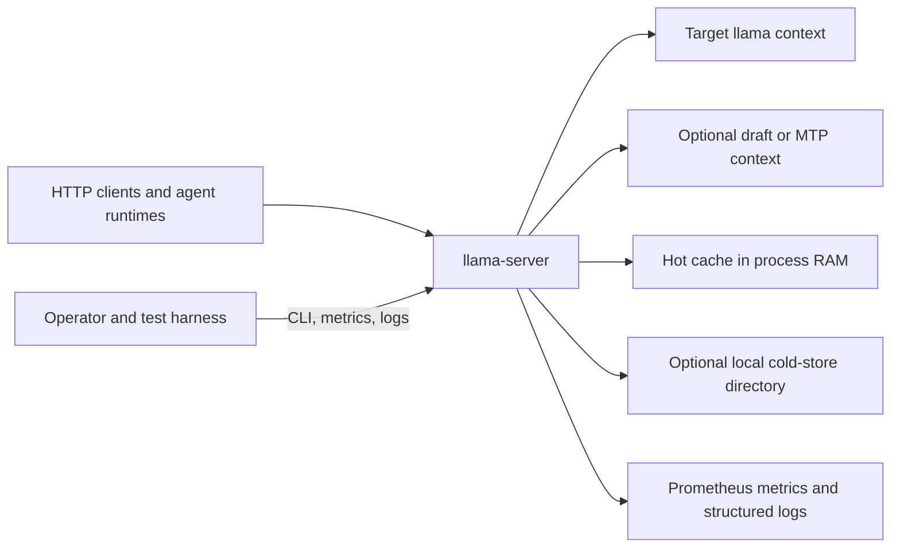

# Part 1: C1 context and drivers

Source: [../cache-handling-architecture.md](../cache-handling-architecture.md)

## System purpose

`llama-server` prepares prompts, schedules inference work, and owns live target
and optional draft model contexts. Hybrid cache reduces repeated prefill work for
branch-heavy chat and agent workloads while preserving the legacy cache as the
default.

Hybrid cache stores model state, not generated output. A cache hit restores a
validated prefix or exact prompt state; normal inference still generates the
response.

## Stakeholders

| Stakeholder | Concern |
| --- | --- |
| Client | Correct output, unchanged request and response schemas, useful cached-token reporting. |
| Operator | Explicit activation, bounded RAM and disk use, startup validation, useful diagnostics. |
| Maintainer | Legacy isolation, clear ownership, deterministic tests, limited public surface. |
| Model runtime | Compatible KV/state layout, correct target/draft pairing, valid checkpoint boundaries. |
| Security reviewer | Local-path confinement, integrity checks, bounded labels, prompt privacy. |

## Scope

The architecture covers:

- explicit `legacy` or `hybrid` cache-controller selection;
- non-destructive exact-state reuse;
- shared branch metadata and checkpoint-aware restore selection;
- metadata-only nodes and safe re-materialization;
- byte-accounted LRU with protected-root preference;
- hot RAM and optional local cold payload storage;
- target-only and target-plus-draft state;
- atomic cache transactions, rollback, and cold-store recovery;
- prepared-prompt metadata, namespace isolation, metrics, and evidence capture.

## Non-goals

- Generated-output replay or response memoization.
- A distributed cache, cross-process coherence, or remote cache service.
- Guaranteed cache restoration after a server restart.
- A public cache-control or cache-inspection endpoint.
- Request fields that let clients force cache placement or protection.
- Replacement of legacy mode as default behavior.

## Architecture drivers

| Driver | Requirement groups | Response |
| --- | --- | --- |
| Opt-in compatibility | R1-R4a, R107-R111 | Factory-selected controller; `legacy` remains default and structurally separate. |
| Shared non-destructive reuse | R15-R26, R69-R89 | Persistent entries, branch forest, slot references, deterministic LRU, protected roots; R20-R20b remain open. |
| Exact and checkpoint restore | R5-R14, R37-R60 | Separate exact and checkpoint descriptors; workload-profile-aware selection. |
| Target/draft correctness | R9-R10, R13, R52, R104 | Binary pair state; save, promote, restore, rollback, and eviction operate on the complete pair. |
| Safe prompt identity | R27-R36d, R123a | Stable compatibility namespace followed by token, checksum, boundary, and descriptor validation. |
| Tiered residency | R37-R60, R93-R98 | Hot payload map, versioned cold files, demotion before capacity eviction, independent metadata retention; the metadata-budget setting remains open. |
| Fail-safe operation | R34-R36d, R90-R92, R120-R124 | Immutable restore plans, transactional apply, bounded miss reasons, recompute fallback. |
| Security and evidence | R61-R68, R121-R129, R132-R133 | Root confinement, checksums, bounded metrics, redacted evidence, fault injection. |

## Quality priorities

Priority order is correctness, isolation, recoverability, compatibility,
observability, then hit rate and throughput. A missed optimization is acceptable.
Restoring incompatible or partial state is not.

The main quality goals are:

- legacy behavior does not change when hybrid mode is off;
- a failed restore leaves the slot usable for normal recomputation;
- no target/draft half-state becomes visible;
- byte accounting explains hot, cold, quarantine, and evicted state;
- lookup and eviction ordering are deterministic under equal scores;
- public metrics use bounded labels and one HELP/TYPE definition per family.

## Platform and build requirement

The reference Windows environment is Visual Studio 2022. Authoritative Windows
build, test, and coverage evidence must use a Developer Command Prompt or
Developer PowerShell for VS2022 and CMake generator `Visual Studio 17 2022`.
The MSVC C++ desktop workload and the repository's documented
[Windows build prerequisites](../../docs/build.md) are required.

VS2026 builds may be used for local investigation, but they do not satisfy the
Windows conformance gate unless the upstream repository build policy changes.
The latest Stage 39 local evidence was produced with VS2026, so a VS2022 rerun
is an open evidence task under this revised architecture baseline.

## System constraints

- One `server_context` owns one cache controller per server backend instance.
- All slots in that backend share controller budgets and branch metadata.
- Cold storage uses an operator-selected local directory and internal file names.
- `--cache-ram 0` disables prompt-cache storage; cold-only mode does not exist.
- The cold layer is runtime cache data. Startup recovery protects transaction
  integrity, but lookup topology is not promised across restart.
- Prompt preparation stays in route/context preparation code. Cache policy does
  not parse raw HTTP JSON.
