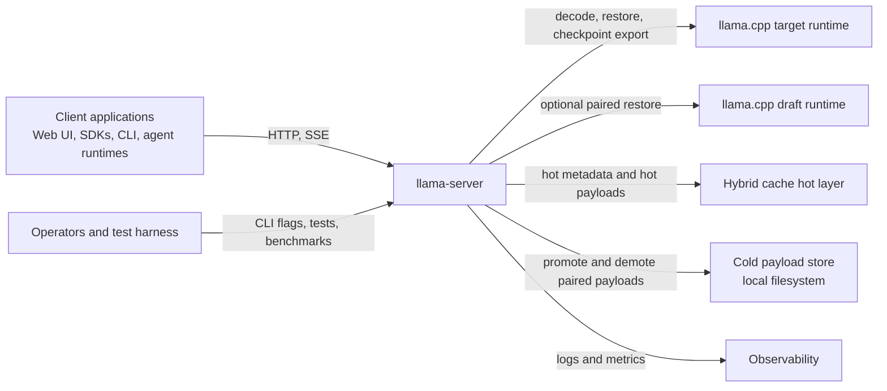
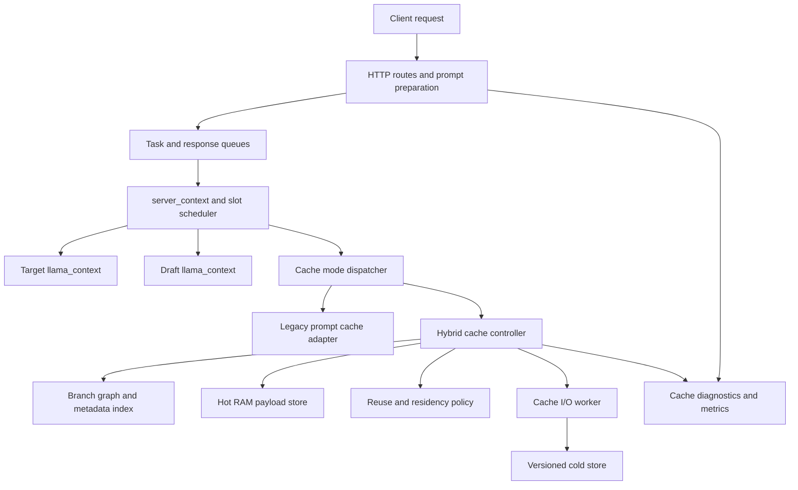
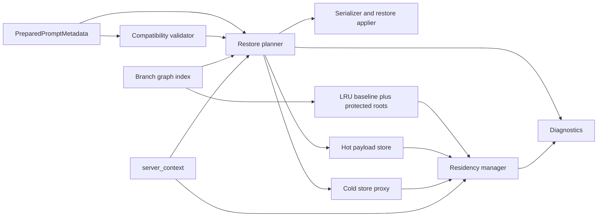
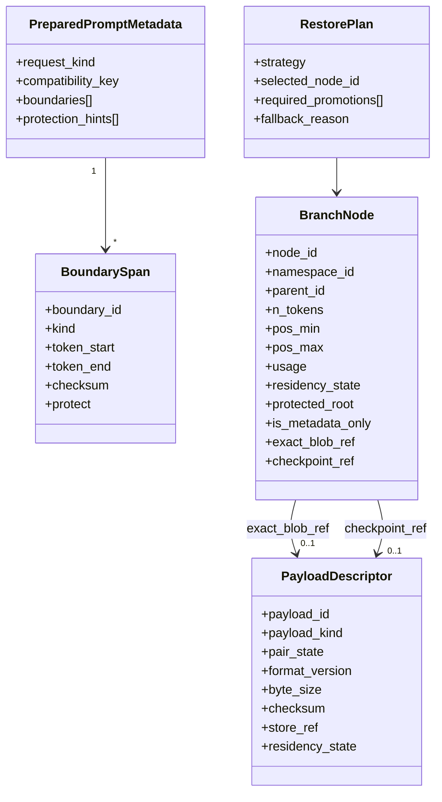

# Software Architecture: Alternate Hybrid Cache Mode for llama-server - Part 1: Method

Source: [../cache-handling-architecture.md](../cache-handling-architecture.md)

## Method

This document follows a C5-style extension of the C4 model:

1. Identify the architecture drivers from the requirements.
2. Compare them with the current `llama-server` cache, checkpoint, and slot lifecycle.
3. Describe the target architecture in five views: Context, Container, Component, Code, and Decision/Delivery.
4. Capture each significant decision as an ADR with researched alternatives, rationale, and consequences.
5. Map the design to phased delivery, security review, observability, and verification.

## Executive Summary

The current `llama-server` cache design is optimized for a simpler RAM-only prompt cache: prompt-cache entries are destructive on hit, eviction is FIFO, checkpoints are lineage-local to a slot prompt, and shorter reusable roots may be removed when a longer descendant is saved. That behavior is adequate for the existing default mode, but it does not satisfy the requirements for branch-heavy, checkpoint-dependent workloads.

The proposed architecture introduces an alternate, explicitly selected `hybrid` cache mode that keeps the current default mode intact. In hybrid mode:

- full-state blobs remain available for exact restore
- checkpoints become the canonical branch structure for checkpoint-dependent workloads
- branch metadata remains resident in RAM even when payload bytes move between hot and cold tiers
- target and draft state are managed as an atomic pair
- cache hits are non-destructive and branch nodes are shared across slots
- a reuse-aware policy replaces FIFO and integrates protected roots, hot/cold residency, and explicit diagnostics
- multiple models or workload profiles can operate concurrently with shared global budgets and namespace isolation

The design is intentionally conservative about integration risk. The current legacy cache path remains structurally intact. New behavior is introduced through a mode gate, a cache-controller interface, and dedicated components for branch graph management, residency policy, payload stores, and prepared-prompt boundary metadata.

## Significant Architecture Requirements

| Driver | Requirement IDs | Architectural response |
| --- | --- | --- |
| Opt-in compatibility | R1-R4, R4a, R107-R111 | Introduce an explicit cache mode switch and a cache-controller dispatch boundary. Leave the legacy path behaviorally unchanged when the alternate mode is disabled. Exact blob restore must remain a supported path in the alternate mode. |
| Hybrid restore model | R5-R14, R37-R60, R69-R89 | Keep exact full-state blobs, promote checkpoints to first-class reusable branch nodes, and support both plain-transformer and checkpoint-dependent restore strategies. |
| Non-destructive shared reuse | R15-R26, R74-R83 | Replace destructive cache hits and flat prompt ownership with a shared branch graph/forest, byte-accounted reuse policy, and protected roots. |
| Prepared-prompt boundaries | R27-R33, R115 | Generate boundary metadata in the HTTP/prompt-preparation layer and carry it into `server_task` so `server_context` never needs to reconstruct message boundaries heuristically. |
| Payload separation and residency | R37-R60, R93-R98 | Separate metadata from payload bytes, keep metadata in RAM, and move both full-state blobs and checkpoint payloads between hot RAM and a versioned cold layer. |
| Target/draft correctness | R9-R10, R13, R52, R104 | Treat target and draft payloads as one paired restore/offload/evict unit unless no draft side exists. |
| Fail-safe correctness | R34-R36, R90-R92, R120-R124 | Make restore plans explicit, validate compatibility and integrity before applying state, and fall back to valid slower paths on failure. |
| Security, observability, and testability | R61-R68, R66a, R121-R129, R132-R133 | Add explicit diagnostics, versioned descriptors, checksums, deterministic clocks/storage seams, and a focused OWASP review for file handling and integrity. Distinguish branch-pruning events from payload-eviction events in metrics and logs. |
| Metadata-only branch nodes and payload/pruning lifecycle | R38a, R38b, R38c, R71a, R71b, R71c, R71d, R71e, R76a, R79a, R79b | Distinguish payload eviction from branch pruning as separate lifecycle events. Retain nodes as metadata-only when their payload is evicted but their topology is needed for descendant discovery or traversal. Re-materialize nodes from the nearest retained payload-bearing ancestor when selected. |
| Validation mismatch and mismatch-parent selection | R36a, R36b, R36c, R36d, R39a, R39b, R39c, R71e, R123a | Reject re-materialization on token mismatch; emit explicit diagnostics; create a new branch from the latest validated ancestor using deterministic tie-breaking on candidate paths. |
| Budget accounting and pruning preference | R8a, R8b, R21a, R57a, R57b, R57c | Define separate accounting for hot payload RAM, branch-metadata RAM, and cold-layer storage. Keep the initial upstream CLI minimal by reusing `--cache-ram`; expose separate budget flags only when later stages need them. Prefer payload demotion or offload before branch pruning when limits can be satisfied by demotion alone. |
| Equivalent-branch deduplication | R83a | When multiple requests converge on the same validated prompt path, reuse or join the equivalent branch node rather than create duplicate nodes. Use deterministic tie-breaking for convergence selection. |
| Eviction policy selection and configuration | R20a, R20b | Use byte-accounted LRU as the first policy. Add a CLI selector only after another policy is implemented, so the upstream surface does not grow before operators have a real choice. |
| Code quality and best practices | R130, R131 | Follow SOLID, KISS, DRY, and YAGNI principles. Factor repeated policy, serialization, residency, and restore logic into shared helpers or components. Avoid copy-pasted logic unless duplication is clearly justified by correctness, isolation, or performance. |

## Current Architecture Baseline

The current server has five behaviors that matter directly to this design.

| Current mechanism | Current behavior | Gap against requirements |
| --- | --- | --- |
| Prompt cache | `server_prompt_cache` stores tokens plus full serialized target and optional draft state in RAM; hits restore and erase the chosen entry; eviction is FIFO; prefix rules delete shorter contained roots. | Violates non-destructive reuse, protected-root retention, shared branch ownership, and checkpoint-first branch continuity. |
| Context checkpoints | `common_prompt_checkpoint` objects are attached to `server_prompt`, pruned oldest-first, and invalidated when rollback/shift makes them unsafe. | Checkpoints are lineage-local, not first-class reusable nodes with independent residency. |
| Idle-slot caching | Idle slots may be saved into prompt cache and cleared when `--cache-idle-slots` is enabled. | Helps RAM pressure, but still feeds the same destructive FIFO cache and does not preserve branch topology. |
| Slot save/restore | The `/slots/{id}` save and restore actions provide exact save/load behavior using the current slot state path. | Exact restore must remain available, but this path is not a substitute for shared branch metadata or paired hybrid residency. |
| HTTP prompt preparation | Chat template application and tokenization already occur in the HTTP layer before work reaches `server_context`. | This is the correct seam for prepared-prompt boundary metadata, but the metadata does not exist yet. |

### Baseline Gaps

- Exact blob restores exist, but they are one-shot cache objects instead of persistent reusable nodes.
- The current prompt cache conflates metadata, payload bytes, eviction policy, and reuse selection.
- Shorter roots can be deleted as "obsolete," which is the opposite of the required shared-tree behavior.
- Checkpoints are not independently addressable, rankable, or cold-resident.
- There is no cold layer, no versioned payload descriptor, and no integrity contract for offloaded payloads.
- There is no explicit request-to-task boundary metadata path for message-aware checkpoint placement.

## Target Architecture

### Design Principles

- Preserve the default mode. The current path remains the `legacy` cache mode and must be easy to reason about.
- Add new behavior through extension boundaries, not scattered conditionals.
- Keep branch metadata always hot in RAM and move only payload bytes between hot and cold tiers.
- Treat target and draft state as one atomic cache object.
- Prefer exact blob restore for plain-transformer workloads and checkpoint-first traversal for checkpoint-dependent workloads.
- Keep all correctness checks explicit and fail closed when compatibility or integrity is uncertain.

### Upstream Compatibility Targets

The design should fit the current `llama-server` architecture rather than create a parallel server surface.

- Keep the feature inside the server's documented memory-management scope: prompt cache, slot state, and context checkpoints. Do not add model-specific public APIs.
- Keep JSON parsing, chat template application, multimodal normalization, and tokenization in the HTTP layer. `server_context` and `server_slot` should receive native C++ task fields, not raw request JSON.
- Keep `server_context` as the owner of live slot/runtime state. Heavy disk I/O, checksum work, and descriptor serialization must run outside the `server_context` thread or behind bounded maintenance steps.
- Preserve router mode boundaries. `server_models` remains independent; each backend instance owns its own cache controller unless a later router-level design is proposed separately.
- Keep external file access disabled by default. Cold persistence must require explicit operator configuration and must not reuse request-provided paths.
- Minimize public surface area for an upstreamable change. Prefer one opt-in mode flag plus existing cache/checkpoint flags. Add more flags only when there is implemented behavior that operators must choose.
- Do not add new HTTP endpoints for the initial upstream target. Use existing logs and the existing Prometheus `/metrics` endpoint when `--metrics` is enabled. Keep `/slots` save/restore behavior unchanged.

### Logical Model

The hybrid mode introduces four core concepts:

1. `PreparedPromptMetadata`
   Captures boundaries, stable spans, protection hints, and request-local cache markers after prompt preparation and tokenization.

2. `BranchNode`
   A reusable node in a shared branch forest. A node may reference a full-state blob, a checkpoint payload, or both. A node may also exist as a **metadata-only node** — without any owned payload descriptor — when it must be retained to preserve topology, lookup, or traversal semantics for retained descendants whose payloads are still restorable. A metadata-only node that becomes the selected restore or branching point must trigger re-materialization from the nearest retained payload-bearing ancestor or from the root.

3. `PayloadDescriptor`
   Metadata for the actual bytes of a full-state blob or checkpoint payload. Descriptors are always hot; payload bytes may be hot or cold.

4. `RestorePlan`
   An explicit plan produced by the hybrid cache controller for exact-blob restore, checkpoint-first restore, or safe fallback.

### Workload Profiles

The restore planner operates with an explicit workload profile instead of one universal algorithm.

- `plain_transformer`: exact blobs and normal prefix reuse remain efficient and valid.
- `checkpoint_dependent`: checkpoints become the canonical branch structure because reuse safety depends on SWA, RS limits, recurrent behavior, or equivalent context restrictions.
- `target_plus_draft`: restore, offload, demotion, and eviction operate on a paired target/draft object.

The workload profile is derived from model/runtime capabilities and request configuration, then attached to the task namespace used by the cache controller.

### Recommended Integration Boundaries

| Proposed module | Responsibility |
| --- | --- |
| `server-cache-mode.*` | Cache-controller interface and `legacy` vs `hybrid` mode dispatch. |
| `server-cache-hybrid.*` | Main hybrid cache controller used by `server_context`. |
| `server-cache-graph.*` | Shared branch graph/forest metadata, indexes, and branch traversal. |
| `server-cache-policy.*` | LRU baseline policy, protected-root handling, and extension point for SLRU/2Q. |
| `server-cache-store.*` | Payload descriptors, serializer contracts, hot store, and cold store abstractions. |
| `server-cache-io.*` | Asynchronous cold-store promotion/demotion worker with deterministic test hooks. |
| `server-cache-boundaries.*` | Prepared-prompt boundary metadata types and normalization helpers. |
| `server-task.*` updates | Task-level cache metadata transport from HTTP layer to `server_context`. |
| `server_context.*` updates | Slot lifecycle hooks that call into the cache controller instead of manipulating hybrid state directly. |

The exact filenames can change, but the responsibility split should remain.

## C5 View

### C1: System Context

The alternate mode changes the internal cache architecture without changing the server's role in the broader system.

### C2: Container View

The important container-level change is the separation between HTTP prompt preparation, cache orchestration in `server_context`, and a dedicated cold-store I/O path.

### C3: Component View

In hybrid mode the cache controller is the only component allowed to decide branch matching, restore selection, offload, or eviction.

Component responsibilities:

- `Compatibility validator`: checks model namespace, tokenizer/template assumptions, LoRA or draft pairing, multimodal safety, and descriptor versions.
- `Restore planner`: ranks exact-blob, checkpoint-first, and fallback candidates.
- `Branch graph index`: stores parent-child relationships, span keys, usage, protection, and residency metadata.
- `Residency manager`: enforces budgets and decides demotion or promotion candidates.
- `Serializer and restore applier`: the only component that turns descriptors back into target/draft runtime state.

### C4: Code View

#### Data Schema

