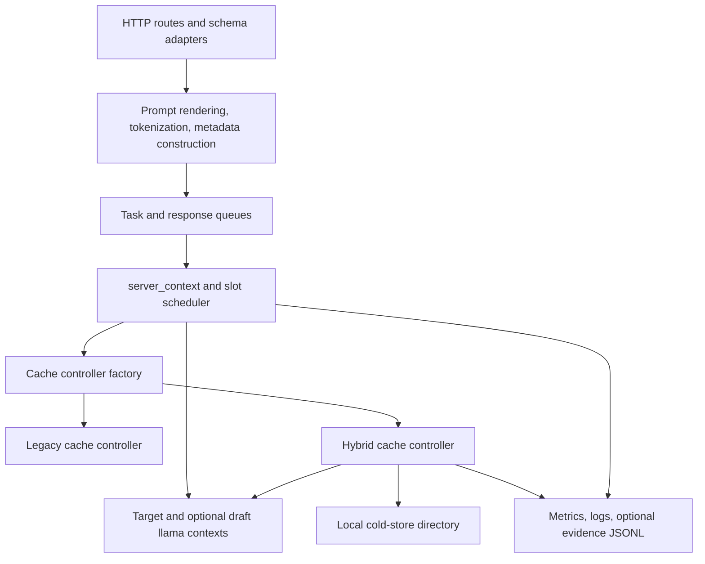

# Part 2: C2 containers and deployment

Source: [../cache-handling-architecture.md](../cache-handling-architecture.md)

## Runtime containers

Hybrid cache runs inside the `llama-server` process. "Container" here means a
C4 runtime boundary, not an operating-system container.

| Container | Responsibility | Trust boundary |
| --- | --- | --- |
| Route and prompt preparation | Validate public request shape, render chat prompts, tokenize, build internal prompt metadata. | Request data is untrusted. |
| Task queue and scheduler | Carry tokens and metadata, select a slot, invoke cache lifecycle hooks. | Internal process boundary. |
| Cache controller factory | Construct `legacy_cache_controller` or `hybrid_cache_controller`. | Operator configuration only. |
| Hybrid controller | Own branch matching, descriptors, policy, transactions, stats, and payload movement. | Sole cache-state mutation authority. |
| llama contexts | Own live target and draft inference state. | Mutated only by slot/runtime code. |
| Cold store | Hold versioned payload and transaction files below one configured root. | Local filesystem boundary. |
| Observability | Export bounded metrics/logs and optional prompt evidence. | Operator-visible output boundary. |

## Deployment model

A normal deployment has one server process, one target model context, zero or
one model-backed draft context, several slots, and one cache controller. Router
or multi-model deployments create separate backend contexts and controllers;
this design does not share cache state between them.

Hot payloads and all branch metadata live in process memory. Cold payload files
live in one existing writable directory. No service listens on behalf of the
cold layer, and no request can choose a cold-store path.

## Configuration

| Option | Current meaning |
| --- | --- |
| `--cache-mode legacy|hybrid` | Select controller. Default is `legacy`. |
| `--cache-ram N` | Hot payload budget in MiB. `-1` is unlimited, `0` disables prompt cache, positive values set a limit. |
| `--cache-cold-path PATH` | Configure local cold storage for hybrid mode. Directory must already exist and be writable. |
| `--cache-cold-max-mib N` | Cold byte budget. `-1` is unlimited, `0` disables cold writes, positive values set a limit. |
| `--cache-prompt-evidence off|redacted|raw` | Optional JSONL evidence mode. Default is `off`. |
| `--cache-prompt-evidence-dir PATH` | Output directory required when evidence is enabled. |
| `--cache-idle-slots` | Route idle-slot saves through the selected controller; requires an enabled prompt cache. |
| `--ctx-checkpoints`, `--checkpoint-min-step` | Control runtime checkpoint production and admission opportunities. |
| `--crash-dump-dir PATH` | On Windows, install the early unhandled-exception dump and terminate-trace handlers. |

Raw evidence also requires the normal prompt-log directory option. Cold budget
and evidence options are rejected when they require hybrid mode but hybrid mode
is not selected. A positive cold budget requires a cold path. Validation occurs
before model load and warmup when prompt cache is enabled.

## Startup sequence

1. Parse CLI and environment settings.
2. Validate cache mode, budgets, evidence mode, and required directories before
   model warmup.
3. Initialize target and optional draft or MTP contexts.
4. Create the selected controller when `--cache-ram` is nonzero.
5. For hybrid mode, derive compatibility fields from initialized runtime state.
6. If cold storage is enabled, normalize and validate the root, recover pending
   cold transactions, reconstruct committed descriptor claims, and remove safe
   orphan `.cold` files.
7. Disable further cold mutation if recovery finds an unknown, corrupt, or
   conflicting manifest. Preserve files for diagnosis.
8. Start request processing.

## Request path

Route adapters preserve their public schemas. They pass normalized request data
to prompt preparation, which builds `server_tokens` and
`prepared_prompt_metadata`. `server_context` then:

1. asks hybrid cache for a restore before normal prompt processing;
2. runs inference or recomputes any unrestored suffix;
3. saves prompt state through the controller when cache policy permits;
4. releases the slot's branch reference when the slot is reset or reassigned;
5. exports controller stats through the existing `/metrics` path.

No cache-specific request field is needed. Server options select behavior for
OpenAI-compatible, Anthropic-compatible, and native completion routes.

Branch metadata accounting and safe-leaf pruning are implemented, but the
production soft maximum is currently `0` (disabled). Only focused test code can
set a nonzero limit; there is no operator option for it.

## Availability behavior

Hybrid cache is an optimization. Missing entries, unsupported profiles, unsafe
prefixes, cold I/O failures, descriptor errors, and restore-apply failures return
control to normal prompt processing. Startup configuration errors fail before
serving requests because their meaning cannot be resolved safely at runtime.
