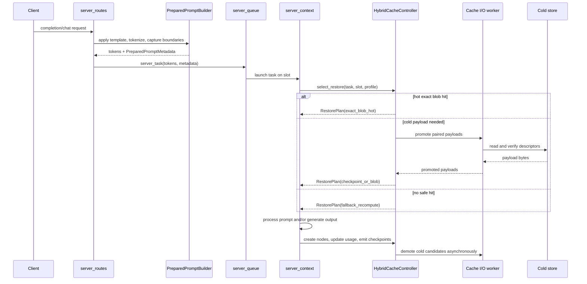
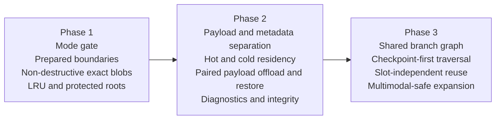

# Software Architecture: Alternate Hybrid Cache Mode for llama-server - Part 2: Restore and Residency Flow

Source: [../cache-handling-architecture.md](../cache-handling-architecture.md)

#### Restore and Residency Flow



### C5: Decision and Delivery View

The design is intentionally staged.



## Runtime Semantics

### Namespace and Compatibility

Every branch graph belongs to a compatibility namespace. The namespace must prevent unsafe cross-restore between materially different runtimes.

At minimum the namespace key should include:

- target model identity
- draft model identity or absence of draft
- tokenizer-compatible prompt semantics
- cache workload profile
- material runtime modifiers that affect state validity, such as active adapters, control vectors, multimodal projector identity, and multimodal token layout

If the namespace does not match, the hybrid cache controller must reject the candidate and fall back safely.

### Multimodal Compatibility

Multimodal support must follow the existing server contracts. The cache layer does not introduce a new media API.

- For chat, completions, and embeddings, keep the documented request formats and media marker substitution behavior.
- Treat media spans as part of the prepared prompt metadata. The compatibility key must include enough information to reject reuse when the media marker count, media token spans, projector identity, or dynamic image token settings differ.
- Do not persist request-provided media payloads in branch metadata. Cache only the resulting model state payloads and internal descriptors.
- When multimodal metadata is incomplete, mark the candidate unsafe for multimodal restore and recompute.
- Keep local media file access governed by the existing `--media-path` behavior. The cold payload store must not accept `file://` paths or other request-derived paths.

### Multi-Namespace Operation

The hybrid cache supports concurrent operation across multiple compatibility namespaces, allowing different model types (plain-transformer and checkpoint-dependent) or different models to be used simultaneously in different slots.

**Shared budget model:**

- All namespaces share the three-part budget pool: hot payload RAM, branch-metadata RAM, and cold-layer storage
- No per-namespace quotas or reservations in the initial implementation
- Budget accounting is global across all active namespaces

**Global eviction policy:**

- When hot payload RAM is exhausted, the LRU policy evicts the globally least-recently-used payload regardless of which namespace owns it
- Protected roots from all namespaces compete for retention based on their protection priority and usage recency
- Eviction decisions treat all namespaces equally; there is no namespace-based fairness or affinity in the initial implementation

**Cross-namespace behavior:**

- Each namespace maintains its own branch forest with independent topology
- Namespaces do not share branch nodes or payloads (cross-namespace restore is forbidden by compatibility validation)
- Usage tracking, residency state, and protection markers are namespace-local
- Cold-layer storage is shared; payloads from different namespaces coexist in the same cold store with namespace metadata in their descriptors

**Future extensibility:**

- The architecture permits future extensions for per-namespace budget quotas, namespace-aware eviction policies (e.g., fair-share scheduling), or namespace priority weights
- The cache controller interface and residency policy abstraction are designed to support these extensions without breaking the initial shared-budget model
- Operators may request namespace-specific behavior through future CLI options or configuration

**Operational implications:**

- Loading multiple models simultaneously consumes budget proportional to their combined working sets
- If one model's workload dominates cache pressure, it may evict payloads from less-active models
- Protected roots should be used judiciously when running multiple models to avoid starvation scenarios
- Budget validation at startup should account for the expected number of concurrent namespaces

### Branch Graph Semantics

- The graph is a forest, not a flat list.
- Shared roots are preserved even when longer descendants exist.
- Slots hold transient references to graph nodes; they do not own branch objects.
- A node may point to an exact full-state blob, a checkpoint payload, or both.
- Branch metadata remains in RAM even when payload bytes are cold.
- Node-level usage, residency, and protection state drive policy decisions.
- **Payload eviction and branch pruning are distinct lifecycle events.** Payload eviction removes payload bytes and clears the payload descriptor from a node; branch pruning removes the node and its metadata from the graph entirely. A node whose payload has been evicted may remain in the graph as a metadata-only node as long as its topology is needed for retained descendants.
- Branch pruning decisions must consider descendant reachability, protection state, and remaining reuse value. Payload eviction alone does not automatically trigger branch pruning.
- When an intermediate node is retained only as a metadata-only node, parent-child topology must remain valid for all retained descendants.
- When multiple requests or slots converge on the same validated prompt path, the implementation must reuse or join the equivalent branch node rather than create duplicate nodes. Convergence selection must use deterministic tie-breaking.
- Each payload descriptor belongs to exactly one branch node. If a retained descendant must remain independently restorable after an ancestor is pruned, that descendant must own its own separate payload descriptor.

### Metadata-Only Branch Nodes and Re-materialization

When a branch node's payload is evicted, the node transitions to metadata-only state. Its token span, checksum span, usage, protection, and parent-child links remain in RAM; only the payload descriptor and bytes are removed.

Rules for metadata-only nodes:

- A metadata-only node may remain in the graph indefinitely as long as its topology is needed for descendant discovery, lookup, or traversal.
- When branch pruning removes a metadata-only ancestor, cold-layer cleanup must verify that no retained descendant relies on a descriptor owned by the pruned node before deletion proceeds.
- When a metadata-only node is selected as the restore or branching point:
  1. Identify the nearest retained payload-bearing ancestor or the root.
  2. Validate the path segment from that ancestor to the selected node against branch metadata using span length, token-range checks, checksums, or equivalent.
  3. On successful validation, replay the path segment from the ancestor's payload, and materialize a new payload at the selected node. Do not materialize payloads for intermediate metadata-only ancestors unless independently justified by policy.
  4. On validation mismatch, do not overwrite or silently repurpose the existing branch metadata. Apply mismatch-parent selection (see Restore Strategy Order, step 2b) and create a new branch from the latest validated ancestor.
- Payload ownership is singular: each payload descriptor belongs to exactly one node. If a descendant must remain independently restorable after its ancestor is pruned, it must hold its own separately owned descriptor.

### Restore Strategy Order

The restore planner should evaluate candidates in this order:

1. Validate namespace and pairing compatibility.
2. Check for an exact full-state blob hit at the deepest matching node.
   - 2a. If the selected node is metadata-only, perform stepwise token validation of the selected path segment against branch metadata (span length, token-range checks, checksums, or equivalent) before proceeding.
   - 2b. On validation mismatch, reject re-materialization of the mismatched path; emit explicit diagnostics; select the deepest validated ancestor on the candidate path as the parent for new-branch creation. If no ancestor validates, use the root. If multiple candidate paths remain eligible after stepwise validation, prefer the path with the longest validated prefix; resolve any remaining tie with a deterministic rule. Any newly materialized payload must belong to the new branch, not to the mismatched metadata-only node.
3. For checkpoint-dependent profiles, traverse checkpoint nodes first and use exact blobs only as accelerators or roots.
4. For plain-transformer profiles, prefer exact blobs and fall back to safe checkpoint reuse only when valid.
5. For metadata-only nodes selected as the restore or branching point, re-materialize from the nearest retained payload-bearing ancestor or from the root. Validate the path segment before replay; materialize a new payload only for the selected node unless additional payloads are independently justified by policy.
6. Promote any cold paired payloads before modifying live slot state.
7. Apply restore atomically to target and draft state.
8. If any stage fails, emit diagnostics and fall back to valid slower processing.

### Prepared-Prompt Boundary Model

The alternate mode depends on prompt boundaries created after prompt preparation, not reconstructed later from the flattened prompt string.

Recommended behavior:

- OpenAI-compatible and Anthropic-compatible public endpoints must use the enabled hybrid-cache enhancements according to server command-line options. Endpoint compatibility means preserving request and response schemas, not bypassing cache behavior.
- Chat-style endpoints: extend the prompt-preparation path so template application can return both the flattened prompt and a boundary trace for message/tool/media boundaries.
- Completion-style endpoints, including `/completion`: derive the richest safe internal metadata available from the already supported prompt shapes. Do not add cache-specific request fields in the upstream target. If message/tool/media boundaries cannot be derived from the request shape, mark the metadata degraded and use token/position fallback rules.
- Boundary metadata must be normalized into `PreparedPromptMetadata` and attached to `server_task` before the task enters `server_context`.
- If no prepared metadata exists, the hybrid planner may use token/position fallback rules, but it must log that it is operating without prepared boundaries.

#### Adopted Jinja Boundary Interface

The preferred upstream implementation is native boundary capture inside the existing prompt-preparation and template-rendering code. It should not require bundled model templates, user templates, or request payloads to include cache markers.

The marker interface below is a private test harness for this fork. It can prove byte-for-byte prompt preservation and fixture coverage, but it is not the target public contract. Each adopted test template defines:

```jinja


    


    
        {{- '<|cache_boundary:' ~ kind ~ (':' ~ label if label else '') ~ '|>' -}}
    


    {{- '<|template_markup:v1:' ~ template_markup.features|join(',') ~ '|>' -}}

```

When all markup feature flags are false or unset, the adopted template must render the same bytes as the source template. When any markup feature is enabled, the template must emit a template-markup header as the first rendered bytes:

```text
<|template_markup:v1:feature_name=feature_version[,feature_name=feature_version...]|>
```

The second field is the markup protocol version. The third field is a comma-separated list of enhancement features present in this render. Each feature has its own version so one enhancement can evolve without changing the protocol or unrelated features. For the current cache-boundary feature, the feature spec is `cache_boundary=1`. Future independent enhancements must add their own feature specs to the same header instead of introducing a second first-position marker.

The boundary parser uses this header to distinguish a marked render from a plain template render. If `cache_boundary=1` is listed, the render may also contain cache-boundary span markers:

| Marker kind | Meaning |
| --- | --- |
| `system_start`, `system_end` | Protected system/developer/tool-definition setup span. |
| `message_start`, `message_end` | One rendered chat message span. The label is usually the rendered role. |
| `tool_call_start`, `tool_call_end` | One assistant tool-call span. The label is the tool name when available. |
| `tool_response_start`, `tool_response_end` | One tool-response span rendered back to the model. |
| `media_start`, `media_end` | One image or video placeholder span. |
| `generation_prompt_start`, `generation_prompt_end` | Assistant generation prefix added by `add_generation_prompt`. |

For fork tests, the boundary builder may render the template with `emit_cache_boundaries=true`, require the rendered prompt to start with `<|template_markup:v1:`, verify that the header lists `cache_boundary=1`, parse the sentinel positions, remove the header and every `<|cache_boundary:...|>` marker, and then tokenize the stripped prompt. The stripped prompt must match the ordinary render byte-for-byte. Do not feed marked prompts to the model.

Markup feature specs and marker labels are metadata, not prompt text. The parser must treat them as untrusted strings, reject malformed headers or markers, and avoid using labels in file paths or shell commands. Template authors should keep feature names and labels short and stable. Feature names should use lowercase ASCII letters, digits, and underscores. Feature versions should be positive integers. Unsupported feature versions must be rejected for the parser that needs that feature; unknown features may be ignored only by parsers that do not depend on them.

#### How to Adapt a Test Jinja Template

To make a test template compatible with this fork-only interface:

1. Define `template_markup = namespace(features=[])` near the top of the file.
2. Each enhancement appends its feature spec when its flag is enabled. For current cache-boundary fixtures, append `cache_boundary=1` when `emit_cache_boundaries=true`.
3. Add the `cache_mark(kind, label='')` macro near the top of the file.
4. Emit `<|template_markup:v1:...|>` immediately after the macro/setup block when `template_markup.features|length > 0`. It must be the first rendered bytes in marked mode, and its feature list must include every enhancement used by that render.
5. Wrap each rendered message with `message_start` and `message_end`.
6. Wrap system or developer setup with both `system_*` and `message_*` markers.
7. Wrap rendered tool calls, tool responses, and media placeholders with their matching start/end markers.
8. Wrap the assistant generation prefix emitted by `add_generation_prompt` with `generation_prompt_*`.
9. Render the original and adopted templates with all markup flags unset and compare bytes.
10. Render the adopted template with `emit_cache_boundaries=true`, verify it starts with `<|template_markup:v1:` and lists `cache_boundary=1`, strip the markup header and `<|cache_boundary:...|>` markers, and compare bytes again.

The adopted templates in `._test_models/*/chat_template_new.jinja` follow this test contract. Their paired `chat_template.jinja` files remain the extracted originals and are used as the baseline for byte-for-byte checks. Do not require this adaptation for upstream users.

### Residency and Eviction Rules

Hybrid mode uses resident-byte accounting across both payload classes.

- **Separate accounting applies:** hot payload RAM, branch-metadata RAM, and cold-layer storage capacity are accounted independently. The initial upstream target should expose only `--cache-ram` for hot payloads and use internal metadata limits; later stages may expose separate budgets when they become necessary.
- **Budget flexibility:** Private-fork or later-stage implementations may define budgets separately for granular control, or provide a single overall cache budget that the implementation allocates between hot and cold layers based on heuristics and available resources.
- **Budget validation at startup:** Configured budgets must be validated at startup. The application must fail with explicit diagnostics if budgets are too low to be practical or if they exceed available resources.
- Branch metadata is always hot and counted against the branch-metadata budget, never against the hot-payload budget.
- Exact blobs and checkpoint payloads share the hot-payload budget.
- Initial policy is byte-accounted LRU with protection flags; the policy API must permit later SLRU or 2Q without changing public semantics. Do not expose a policy selector until at least two policies are implemented.
- When budgets are under pressure, the policy must prefer payload demotion to the cold layer or cold-layer offload over branch pruning, as long as demotion alone can satisfy the limit while preserving useful branch structure. Branch pruning is a last resort.
- Protected roots raise eviction priority but do not bypass accounting.
- If protected roots alone exceed budget, the controller must emit explicit diagnostics and refuse further protected admissions or demotions that would break correctness.
- Cold demotion is driven by usage and budget pressure, not insertion order.
- Payload eviction and branch pruning are governed by separate rules. A branch node may have its payload evicted while remaining in the graph as a metadata-only node. Branch pruning removes the node and its metadata entirely, and is subject to descendant-reachability and protection checks.

### CLI Options

This architecture keeps the existing cache flags and adds at most one new flag for the initial upstream target. Size values are in MiB unless the option says otherwise. Future flags are listed for design traceability, but they should stay out of an upstream PR until the corresponding behavior exists and cannot be controlled by an existing option.

| Option | Status | Description and usage |
| --- | --- | --- |
| `--cache-mode MODE` | New, minimal upstream target | Selects the cache controller. Valid values: `legacy`, `hybrid`. Omit it, or use `--cache-mode legacy`, to keep the current prompt-cache behavior. Use `--cache-mode hybrid` to enable the alternate controller. Hybrid mode still requires an enabled cache budget, so pair it with `--cache-ram N`. Example: `--cache-mode hybrid --cache-ram 8192`. |
| `-cram N` | Existing upstream | Short form of `--cache-ram N`. |
| `--cache-ram N` | Existing upstream, reused | Sets the prompt-cache RAM budget. `0` disables the prompt cache, `-1` removes the limit, and positive values set the limit in MiB. In legacy mode this remains the full prompt-cache limit. In hybrid mode it is the hot payload budget for the upstreamable implementation. |
| `-ctxcp N` | Existing upstream | Short form of `--ctx-checkpoints N`. |
| `--ctx-checkpoints N` | Existing upstream, reused | Sets the maximum number of context checkpoints per slot. `0` disables checkpoint creation. In hybrid mode, checkpoints become reusable payload candidates in later stages, but this option still controls how many runtime checkpoints may be produced per slot before they are admitted to the cache controller. |
| `--swa-checkpoints N` | Existing upstream | Alias of `--ctx-checkpoints N`. |
| `-cpent N` | Existing upstream | Short form of `--checkpoint-every-n-tokens N`. |
| `--checkpoint-every-n-tokens N` | Existing upstream, reused | Sets checkpoint creation frequency during prefill. `-1` disables periodic checkpoint creation. Use smaller values for branch-heavy workloads that benefit from more restore points, and larger values to reduce checkpoint overhead. |
| `--cache-idle-slots` | Existing upstream, reused | Enables saving idle slots to the prompt cache and clearing them when a new task arrives. In legacy mode this feeds `server_prompt_cache`. In hybrid mode it must call the cache controller so idle-slot saves follow the same pairing, policy, and residency rules as normal cache saves. This option still requires `--kv-unified` and a nonzero cache budget. |
| `--no-cache-idle-slots` | Existing upstream | Disables idle-slot cache saves. Use this when slot state should stay resident until the normal slot lifecycle clears it. |
| `--cache-eviction-policy POLICY` | Deferred | Do not add this for the initial upstream target. Start with LRU as the only hybrid policy. Add a selector only after another implemented policy exists. |
| `--cache-budget-hot-ram N` | Deferred | Prefer `--cache-ram N` for the upstreamable implementation. Add this only if a later implementation needs separate hot-payload accounting that cannot be expressed through `--cache-ram`. |
| `--cache-budget-metadata-ram N` | Deferred | Keep metadata accounting internal at first. Add this only after metadata pressure becomes an operator-facing tuning problem. |
| `--cache-budget-cold-storage N` | Deferred/private fork | Cold persistence is a later, opt-in file-writing feature. Do not include this in the initial upstream target. |
| `--cache-budget-total N` | Deferred/private fork | Avoid a second budget model in the initial upstream target. Prefer explicit existing budgets. |
| `--cache-cold-dir DIR` | Deferred/private fork | Required only if cold persistence is implemented. It must be disabled by default, normalized at startup, and never derived from request input. |

Startup validation should reject conflicting or unsupported combinations before the server accepts requests. In particular, hybrid-only flags should fail when `--cache-mode legacy` is selected, cold-storage flags should require an explicit directory if that stage is implemented, and target/draft configurations must use budgets large enough to admit paired payloads.

