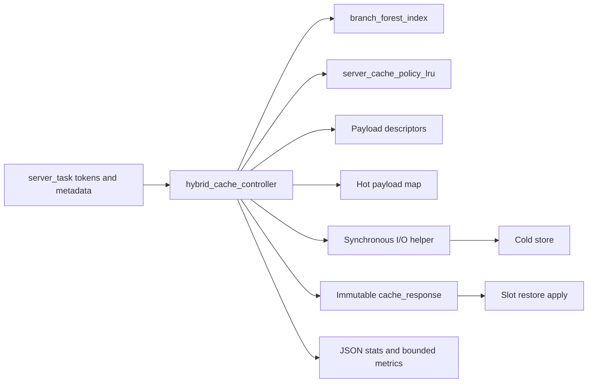
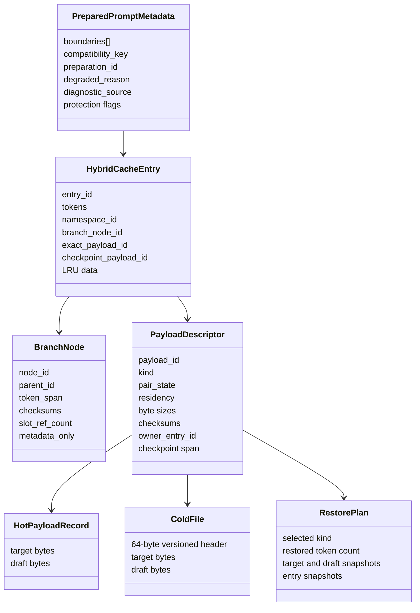

# Part 3: C3 components and data

Source: [../cache-handling-architecture.md](../cache-handling-architecture.md)

## Component view

## Responsibilities

| Component | Owns | Must not own |
| --- | --- | --- |
| Prompt metadata builder | Boundary spans, checksums, degraded reason, route source. | Cache matching or eviction policy. |
| `hybrid_cache_controller` | Entries, descriptors, hot bytes, transactions, matching, policy coordination, metrics state. | Public request parsing or generated-output replay. |
| `branch_forest_index` | Namespace topology, token spans, prefix checksums, metadata budget, slot refs. | Serialized target/draft bytes. |
| `server_cache_policy_lru` | Deterministic byte-based hot victim plan and protected-root ordering. | State mutation or cold I/O. |
| `server_cache_store_cold` | File format, path confinement, staging, manifests, quarantine, recovery, reads. | Branch lookup or runtime compatibility. |
| `server_cache_io_worker` | Synchronous read/write adapter retained for controller wiring. | Threads, queues, or background mutation. |
| Slot restore apply | Live llama state mutation and rollback snapshot. | Cache candidate selection. |

## Core data model

## Prompt metadata

`prepared_prompt_metadata` contains token-indexed system, message, and tool-call
spans. Chat metadata is inferred from rendered text and tokenized through the
same vocabulary as the request. The builder also emits `[0, message_end]`
prompt spans with checksums at each usable chat checkpoint and at end of prompt.
Those spans are required for safe checkpoint and strict-prefix decisions.

When rich boundaries cannot be derived, metadata records a bounded degraded
reason. Degraded metadata may still support exact token restore, but it does not
gain protected-root or unsafe prefix privileges.

## Compatibility namespace

Namespace is a candidate-partitioning key, not proof that a restore is safe.
Current stable inputs include:

- target model path and structural model parameters;
- tokenizer and chat-template identity;
- draft mode and draft model identity;
- LoRA adapters and control vectors;
- multimodal projector identity;
- context size, batch size, unified-KV setting, and workload profile;
- `prepared_prompt_metadata.compatibility_key` when supplied.

Prompt-local boundaries, checksums, preparation IDs, degraded reasons, request
IDs, and prompt text do not enter the namespace. They remain validation or
diagnostic data. This keeps namespace cardinality bounded while token and
checksum checks prevent cross-prompt contamination.

## Entries, nodes, and ownership

One `hybrid_cache_entry` represents one prompt-token path in one namespace. It
points to one branch node and may own one exact descriptor, one checkpoint
descriptor, both, or neither.

Each payload descriptor has exactly one owning entry and one payload kind.
Target and draft byte vectors are fields of that descriptor's one payload pair;
they are not independently addressable. Exact and checkpoint descriptors on the
same entry are independent policy candidates because they serve different
restore points.

A branch node can outlive its payload. Payload eviction clears restorable bytes
and leaves an evicted descriptor tombstone and metadata-only topology. Branch
pruning is separate and may remove only a metadata-only leaf that has no active
slot reference, is not protected, and has no retained descendant.

## Workload profiles

| Profile | Detection | Preferred payload |
| --- | --- | --- |
| `plain_transformer` | Target model has no constrained SWA, recurrent, or hybrid behavior. | Exact blob, then valid checkpoint. |
| `checkpoint_dependent` | Constrained SWA, recurrent model, or hybrid model. | Checkpoint, with exact fallback only where descriptor rules permit. |
| `unsupported` | Runtime/model information is unavailable or unsafe. | Recompute. |

Clients do not select the profile.

## Pair states

`target_only` is valid when no model-backed draft context exists.
`target_and_draft` is required for separate draft models, target-derived MTP
contexts, and separate-model MTP contexts. The compatibility key distinguishes
these runtime shapes even though descriptor pair state remains binary.

Pair checks cover admission, restore, cold serialization, promotion, rollback,
accounting, and eviction. A draft runtime cannot consume target-only state, and
a target-only runtime cannot consume a paired descriptor.

## Stable invariants

- I-01: Legacy and hybrid controllers never share mutable cache state.
- I-02: Every restorable payload has one valid descriptor and owner entry.
- I-03: Target/draft pairs transition as one unit.
- I-04: Namespace compatibility is necessary but never sufficient for restore.
- I-05: Cache hits are non-destructive and refresh deterministic usage data.
- I-06: Payload eviction and branch pruning are different lifecycle events.
- I-07: Active slot references prevent unsafe node or payload removal.
- I-08: Cache-state mutations are serialized by the controller transaction lock.
- I-09: A restore plan is immutable after capture.
- I-10: Capacity pressure does not evict payload bytes while an enabled hot or
  cold layer can retain the complete pair.
