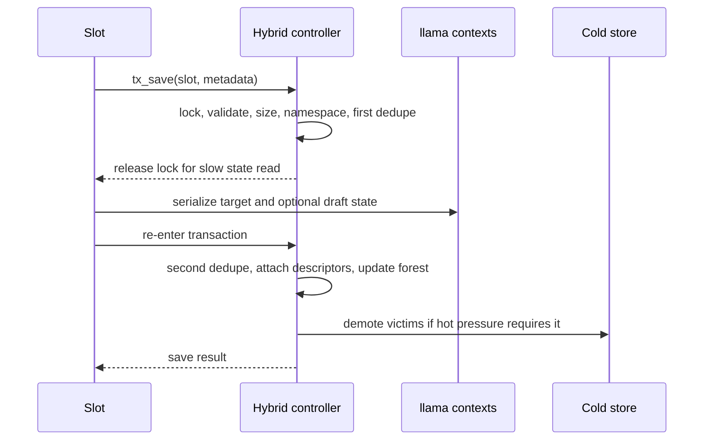
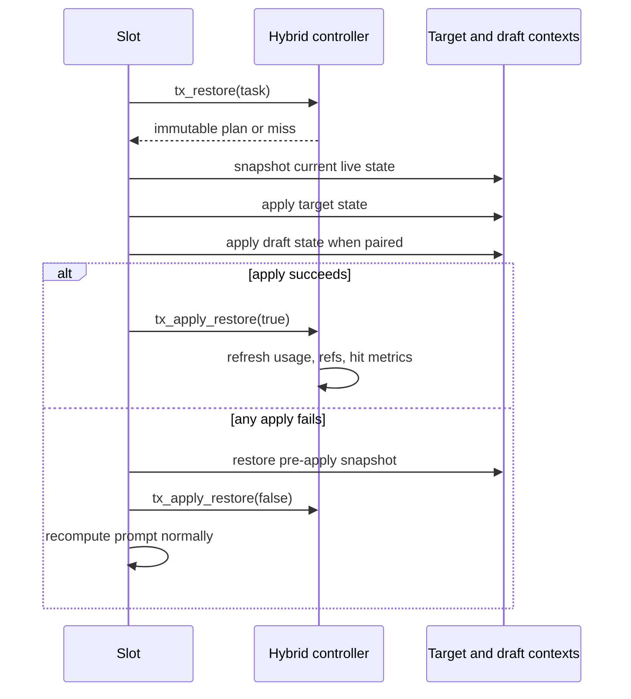

# Part 4: C4 runtime behavior

Source: [../cache-handling-architecture.md](../cache-handling-architecture.md)

## Save flow

`tx_save` is idempotent for an equivalent token path and namespace.

Save behavior:

1. Reject an empty slot, missing task, empty target state, or missing draft state
   for a draft runtime.
2. Compute target plus draft size, protection, stable namespace, and prompt-only
   token vector. Generated tokens are not part of the saved key.
3. Reject a newly saved payload larger than the configured positive hot budget.
   Current implementation does not admit new entries directly to cold storage.
4. Refresh an equivalent restorable entry instead of duplicating it.
5. Release the cache mutex before reading large state buffers from llama
   contexts. This avoids holding the global cache lock over the slow read.
6. Reacquire the mutex and repeat deduplication. A concurrent winner is kept and
   the newly read bytes are discarded.
7. Re-materialize an equivalent metadata-only entry in place, or create one new
   entry and branch node with an exact descriptor.
8. Admit the latest eligible checkpoint as a separate checkpoint descriptor.
9. Acquire the branch-node reference for the saving slot and run bounded
   maintenance.

## Restore selection

`tx_restore` performs lookup and captures a restore plan under the cache mutex.

1. Build the stable lookup namespace and detect workload profile and pair state.
2. Search the branch forest by full token span and by `[0, boundary_end]`
   checksum spans.
3. Reject candidates from incompatible namespaces.
4. Rank candidates by validated token relationship and payload suitability.
5. Prefer checkpoints for checkpoint-dependent profiles and exact blobs for
   plain transformers.
6. For a cold descriptor, promote and validate it synchronously before capture.
7. Validate descriptor version, kind, owner, sizes, checksums, pair state,
   checkpoint span, and runtime compatibility.
8. Deep-copy payload bytes, prompt tokens, checkpoints, and metadata into an
   immutable `cache_response`.

An exact request must match the full cached prompt token vector. An accepted
checkpoint plan can restore fewer tokens than the complete request.

## Strict-prefix safety

A cached prompt may be a strict prefix of a new request only when all of these
conditions hold:

- route metadata source is `openai-chat`;
- cached tokens match the request through the claimed restore count;
- the restore count is positive, inside the cached entry, and shorter than the
  new request;
- entry and request checksums agree at the boundary;
- exact-blob prefixes have matching `[0, prefix_end]` message-end boundaries in
  both prepared metadata records;
- checkpoint descriptors use `[0, prefix_end]` and carry the same nonzero
  boundary checksum;
- checkpoint-dependent and target-plus-draft runtimes use a checkpoint-safe
  prefix payload, not an arbitrary exact blob;
- normal descriptor, namespace, pair, and residency validation also succeeds.

`/completion` and other non-chat sources do not use strict-prefix restore. They
recompute and record `unsafe_prefix_rejected`. Failure does not mutate the slot,
refresh LRU state, or count a hit.

## Restore apply and rollback

The cache mutex is not held while live llama state is applied. Other slots can
use the controller during that period because the plan owns deep copies of all
required payload and entry data. Finalization re-enters the transaction lock.

Public accounting keeps full request `prompt_tokens`. `cached_tokens` and the
internal timing `cache_n` report only the restored prefix length.

## Miss and fallback taxonomy

Every rejected lookup maps to one bounded reason:

| Reason | Meaning |
| --- | --- |
| `namespace_mismatch` | Same prompt shape exists only in an incompatible runtime namespace. |
| `token_count_mismatch` | Candidate token length cannot satisfy the requested restore. |
| `checksum_mismatch` | Token or boundary checksum validation failed. |
| `exact_entry_absent` | No exact eligible entry exists. |
| `unsafe_prefix_rejected` | A prefix candidate exists but safety was not proved. |
| `payload_unavailable` | Descriptor or bytes are absent, invalid, or cannot promote. |
| `unsupported_route_or_profile` | Route, runtime profile, or transaction state cannot use the path. |

All misses preserve inference correctness through normal processing.

## Hot pressure and two-layer retention

Hot payload accounting counts descriptor-owned bytes resident in RAM. LRU uses
deterministic `use_sequence` and insertion/entry identifiers as tie-breakers.
Protected roots are considered after ordinary entries, but protection never
removes bytes from accounting.

On hot pressure:

1. Rank eligible hot victims with LRU and protection policy.
2. If cold storage is disabled, record `bypassed/cold_disabled` and apply safe
   hot-only eviction semantics.
3. If cold is enabled, serialize the complete target/draft pair to a staging
   file and obtain its exact file length.
4. Make cold room by selecting deterministic, ownership-safe cold victims.
5. Commit demotion before releasing hot bytes.
6. Evict the hot payload only when both enabled layers are capacity-exhausted.
7. Preserve branch metadata and an evicted descriptor tombstone.

I/O, integrity, and arithmetic failures are not capacity exhaustion. They retain
the original hot payload and report `retained_hot` with `io_error`,
`integrity_error`, or `size_overflow`.

## Cold admission transaction

The cold transaction uses exact serialized bytes, including the 64-byte header.
Checked unsigned arithmetic prevents overflow.

1. Prepare and validate an immutable staging file.
2. Write a transaction manifest with incoming descriptor and victim pre-state.
3. Rename each cold victim to a unique quarantine name under the same root.
4. Publish the incoming file by rename and validate its final form.
5. Atomically mark the manifest committed.
6. Apply incoming and victim descriptor/accounting state, release hot bytes,
   then delete quarantined victims and the manifest.

Before commit, rollback restores quarantined victims and removes incoming work.
After commit, recovery completes cleanup. Quarantine bytes remain charged until
deletion succeeds. Recovery is idempotent. Corrupt or conflicting recovery data
disables cold mutation rather than guessing.

## Metadata pressure

Metadata accounting has a separate soft-budget mechanism. When a nonzero soft
maximum is set, the controller prunes only safe metadata-only leaves and never
uses payload pressure as permission to remove branch topology. When no safe node
can be pruned, metadata admission is rejected with diagnostics. Production
configuration currently leaves this maximum at `0` (disabled); focused tests
set it through a test-only helper.

## Speculative decode invariant

Every target or draft `llama_decode` call must stay within that context's
`cparams.n_outputs_max`. Target speculative decode is chunked by the per-context
cap and parallel count. MTP draft contexts reserve
`n_parallel * (1 + speculative_n_max)` outputs. This invariant belongs to the
slot decode path, but hybrid restore must preserve the runtime shape on which the
cap was calculated.
