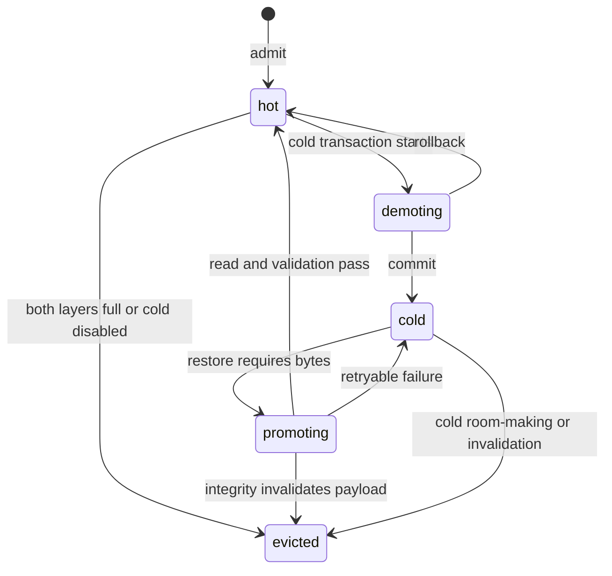

# Part 5: C4 code and interfaces

Source: [../cache-handling-architecture.md](../cache-handling-architecture.md)

## Code map

| Source | Architectural role |
| --- | --- |
| `common/arg.cpp` | CLI parsing and cache option validation at argument level. |
| `tools/server/server-cache-controller.h` | Controller abstraction and factory contract. |
| `tools/server/server-cache-controller.cpp` | `legacy` or `hybrid` construction. |
| `tools/server/server-cache-legacy.h` | Adapter over existing destructive FIFO prompt cache. |
| `tools/server/server-cache-hybrid.*` | Hybrid orchestration, transactions, descriptors, matching, residency, stats. |
| `tools/server/server-cache-graph.*` | Branch forest, deterministic lookup, slot refs, metadata pruning. |
| `tools/server/server-cache-policy-lru.*` | Byte-accounted hot eviction plans and protected ordering. |
| `tools/server/server-cache-store-cold.*` | Cold format, confined file operations, manifests, recovery. |
| `tools/server/server-cache-io-worker.*` | Thin synchronous cold read/write helper; no worker thread remains. |
| `tools/server/server-task.h` | Prepared prompt metadata and task transport. |
| `tools/server/server-slot.h` | Slot cache transaction depth, branch reference, restored state. |
| `tools/server/server-context.cpp` | Metadata builders, slot lifecycle, apply/rollback, metrics export. |
| `tools/server/server-crash-handler.*` | Optional Windows unhandled-exception minidump support. |
| `tools/server/server.cpp` | Server startup, optional terminate traces, and guarded Stage 39 live-test route registration. |
| `tools/server/CMakeLists.txt` | Server cache sources and test-only compile gates. |
| `tests/test-cache-controller.cpp` and focused step tests | Controller, graph, policy, cold-store, transaction, and metrics tests. |

## Controller interface

`cache_controller` exposes `save_slot`, `load_slot`,
`try_restore_from_cache`, `release_branch_node_ref`, `update`, `get_stats`,
`size`, and `n_tokens`. Legacy uses the general interface. Hybrid public methods
delegate to canonical transaction entry points.

| Hybrid operation | Lock and side effects |
| --- | --- |
| `tx_save` | Short validation/dedupe lock, unlocked llama state read, final admission lock. |
| `tx_restore` | Locked lookup, cold promotion, validation, and immutable plan capture. |
| `tx_apply_restore` | Locked success/failure finalization after live apply. |
| `tx_load` | Locked compatibility path retained for controller interface parity. |
| `tx_update` | Locked hot eviction, cold cleanup, token limit, and metadata maintenance. |
| `tx_demote_payload` | Locked two-layer cold transaction. |
| `tx_promote_payload` | Locked cold read, integrity validation, and hot transition. |
| `tx_evict_entry` | Locked payload eviction decision; does not imply branch pruning. |

A recursive mutex supports the documented nested transaction calls. A bounded
reentrancy guard rejects depth beyond the configured internal limit. Waits over
500 ms emit a bounded diagnostic but do not weaken mutual exclusion.

## Residency state machine

`demoting` and `promoting` are internal transitional states. Because I/O is
synchronous, no background queue exposes them to another controller operation.
`evicted` is terminal for that descriptor.

## Cold file contract

Each `.cold` file starts with a fixed 64-byte little-endian header:

| Field | Contract |
| --- | --- |
| Magic | `LCCC` (`0x4C434343`). |
| Format | Version 1. Unknown versions are rejected. |
| Checksum algorithm | FNV-1a identifier plus header checksum. |
| Identity | Internal payload ID and pair state. |
| Lengths | Exact target and draft byte lengths. |
| Integrity | Target and draft checksums. |

Read validation checks magic, version, header checksum, algorithm, payload ID,
pair state, lengths, and content checksums before returning bytes. File names are
derived from internal IDs. Staging, quarantine, claim, and manifest files stay
under the normalized cold root.

## Prepared-prompt interface

`prompt_boundary` carries type, inclusive token start, exclusive token end,
checksum, protection hint, and bounded metadata. Current types cover system,
message, and tool-call starts and ends.

`prepared_prompt_metadata` carries boundaries plus a stable compatibility key,
preparation ID, degraded reason, diagnostic source, protection flags, and a
native/inferred marker. It is attached to `server_task` after prompt rendering
and tokenization.

The cache does not depend on template-injected marker text. Test fixtures may
exercise boundary construction, but marked text must never reach inference.

## Route contract

Hybrid cache runs on server completion tasks selected by normal route adapters.
Public schemas remain unchanged. `/v1/chat/completions` identifies its internal
source as `openai-chat` and is the only current route eligible for strict-prefix
restore. Other route adapters retain distinct source IDs and can use exact
restore, but an otherwise matching prefix is rejected and recomputed. Embedding
and infill tasks do not enter hybrid prompt-cache restore because the controller
hook is limited to `SERVER_TASK_TYPE_COMPLETION`.

No public endpoint exposes branch IDs, payload IDs, cold paths, checksums, or
cache mutation controls. `LLAMA_STAGE39_LIVE_TEST_SEAM` adds a guarded local test
surface only in builds that explicitly enable it; production builds keep it off.

## Observability interface

Public cache metrics use the `llamacpp:` prefix and bounded labels. Main groups:

| Group | Representative families |
| --- | --- |
| Reuse | `cache_hits_total`, `cache_misses_total`, `cache_restore_misses_total`, `cache_prefix_candidates_total`. |
| Namespace and graph | `cache_namespace_count`, `cache_branch_lookups_total`, `cache_slot_ref_*`, `cache_branch_pruning_total`. |
| Payload lifecycle | `cache_exact_blob_restores_total`, `cache_payload_transitions_total`, `cache_payload_evictions_by_shape_total`. |
| Checkpoints | `cache_checkpoint_hits_total`, `cache_checkpoint_restores_total`, `cache_checkpoint_admissions_total`. |
| Residency | `cache_bytes`, `cache_cold_payload_bytes`, `cache_cold_budget_bytes`, promotion/demotion counters. |
| Two-layer decisions | `cache_two_layer_decisions_total{mode,result,reason}`. |
| Cold transactions | `cache_cold_transactions_total{mode,result,reason}`. |
| Evidence and diagnostics | `cache_prompt_evidence_records_total`, `cache_structured_diagnostics_total`. |

Raw namespace IDs and payload IDs do not appear in public labels. Aggregate
namespace metrics use bounded `scope="all"`. Internal `get_stats()` JSON and
bounded logs carry deeper diagnostic detail.

## Two-layer label taxonomy

`cache_two_layer_decisions_total` accepts only:

- result: `retained_cold`, `evicted`, `bypassed`, `retained_hot`;
- reason: `cold_room`, `cold_room_made`, `both_filled`, `oversized_both`,
  `cold_disabled`, `io_error`, `integrity_error`, `size_overflow`.

`cache_cold_transactions_total` accepts result `commit`, `rollback`, or
`recovery`, and reason `none`, `stage_write`, `stage_validate`,
`victim_quarantine`, `incoming_publish`, `apply`, `commit_marker`, `cleanup`, or
`manifest`. Invalid enum values produce no public series and trigger an internal
diagnostic.
